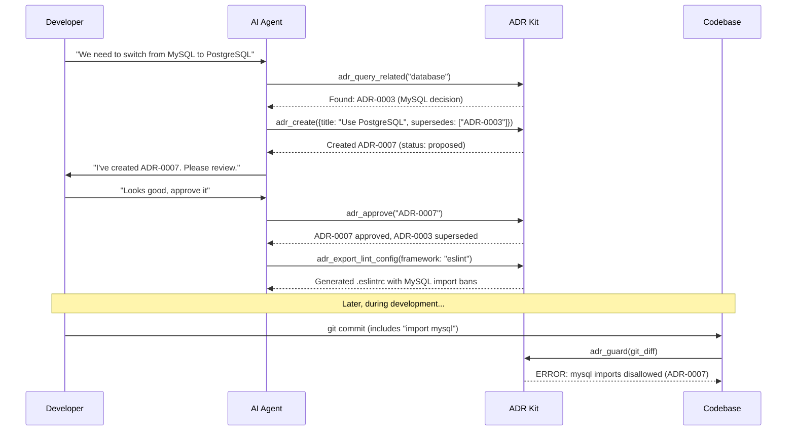

# ADR Kit

**AI-First Architectural Decision Records** - A toolkit designed for autonomous AI agents to manage ADRs in MADR format with rich contextual understanding and workflow automation.

[](https://www.python.org/downloads/)
[](https://opensource.org/licenses/MIT)

## 🤖 AI-First Design

ADR Kit is purpose-built for AI agents like **Claude Code** to autonomously manage architectural decisions. It provides "dumb but reliable" infrastructure that enforces standards and enables controlled AI agent operation through rich MCP (Model Context Protocol) tools.

## ✨ Features

- **🎯 6-Entry-Point Architecture** - Clean agent interface with comprehensive internal workflows
- **🤖 Smart Agent Interface** - Agents make decisions, tools handle automation
- **🔄 Enforced Workflow** - Analyze → Preflight → Create → Approve → Supersede → Plan
- **📋 Constraints Contract** - Single source of truth from all accepted ADR policies  
- **🚪 Preflight Policy Gate** - Proactive decision interception before implementation
- **🧠 Planning Context Service** - Curated architectural intelligence for agents
- **🛡️ Automatic Guardrail Manager** - Auto-apply configuration fragments from ADR policies
- **🔍 Semantic Search** - Vector-based intelligent ADR discovery and matching
- **📝 MADR-compliant** ADR creation, validation, and policy enforcement
- **⚡ Policy Guard System** - Automated code analysis for ADR policy violations
- **🛡️ Immutability Protection** - Content digests and tamper detection for approved ADRs
- **📊 Multi-format Indexing** - JSON and SQLite with automatic relationship tracking
- **🎯 Structured Policies** - Extract and enforce architectural decisions as lint rules
- **🌐 Static Site Generation** - Beautiful documentation via Log4brains integration
- **🚀 Rich Internal Automation** - Comprehensive workflows triggered by simple entry points

## 🚀 Quick Start

### 1. Installation

```bash
# Install ADR Kit in your project
pip install adr-kit

# For semantic search (optional but recommended)
pip install sentence-transformers
```

### 2. Initialize in Your Project

```bash
# Set up ADR structure
cd your-project
adr-kit init

# Start the new 6-entry-point MCP server for AI integration
adr-kit mcp-server-v2
```

### 3. AI Agent Integration

**For Cursor/Claude Code** - Add to your MCP settings.json:
```json
{
  "mcpServers": {
    "adr-kit": {
      "command": "adr-kit",
      "args": ["mcp-server-v2"],
      "env": {}
    }
  }
}
```

**Then in your AI chat:**
- "Analyze my project for architectural decisions that need ADRs"
- "Check if I can use PostgreSQL in this project" 
- "Create an ADR for switching to React"
- "Give me architectural context for implementing user authentication"

## 🎯 New 6-Entry-Point Architecture

ADR Kit V2 implements a revolutionary **6-entry-point architecture** where agents make intelligent decisions and comprehensive internal workflows handle all automation:

### 🚪 The 6 Entry Points for AI Agents

#### 1. **`adr_analyze_project()`** - Analyze Existing Projects
**Purpose:** Generate analysis prompt for existing codebases
- 🤖 **Agent Intelligence:** Analyze project structure, identify architectural patterns
- ⚡ **Internal Automation:** Scans technology stack, avoids duplicating existing ADRs
- 📋 **Returns:** Structured prompt guiding agent to propose specific ADRs

#### 2. **`adr_preflight(choice)`** - Validate Technical Choices  
**Purpose:** Check if technical choice requires ADR or conflicts with existing decisions
- 🤖 **Agent Intelligence:** Understanding implications and deciding next steps
- ⚡ **Internal Automation:** Loads constraints, checks conflicts, ranks relevance
- 📋 **Returns:** ALLOWED | REQUIRES_ADR | BLOCKED + actionable guidance

#### 3. **`adr_create(proposal)`** - Create ADR Proposals
**Purpose:** Generate comprehensive ADR with conflict detection and validation
- 🤖 **Agent Intelligence:** Writing context, decision, consequences, structured policies  
- ⚡ **Internal Automation:** ID generation, semantic search, conflict detection, MADR formatting
- 📋 **Returns:** ADR ID, file path, conflicts detected, review guidance

#### 4. **`adr_approve(adr_id)`** - Approve ADRs (Triggers All Automation)
**Purpose:** Activate ADR and trigger comprehensive automation pipeline
- 🤖 **Agent Intelligence:** Understanding approval implications, handling partial failures
- ⚡ **Internal Automation:** Contract rebuild, guardrails, enforcement rules, indexes, validation
- 📋 **Returns:** Comprehensive automation report with policy enforcement status

#### 5. **`adr_supersede(old_adr, new_proposal)`** - Replace Existing ADRs
**Purpose:** Replace architectural decisions while maintaining relationships
- 🤖 **Agent Intelligence:** When to supersede vs. create new, comprehensive replacement content
- ⚡ **Internal Automation:** Creates new ADR, updates relationships, optional auto-approval
- 📋 **Returns:** Superseding results with relationship updates and automation status

#### 6. **`adr_planning_context(task)`** - Get Architectural Context
**Purpose:** Provide curated architectural context for specific agent tasks  
- 🤖 **Agent Intelligence:** Interpreting guidance, applying patterns, following constraints
- ⚡ **Internal Automation:** Task analysis, ADR relevance ranking, constraint extraction, guidance generation
- 📋 **Returns:** Relevant ADRs, constraints, technology recommendations, compliance checklist

### 🔧 Internal Workflow System

Each entry point triggers comprehensive **internal workflows** that handle all the complexity:

**Workflow Components:**
- **AnalyzeWorkflow** - Project analysis and ADR opportunity identification
- **PreflightWorkflow** - Technical choice validation with conflict detection  
- **CreationWorkflow** - ADR creation with semantic search and validation
- **ApprovalWorkflow** - Complete automation pipeline (contract, guardrails, enforcement)
- **SupersedeWorkflow** - ADR replacement with relationship management
- **PlanningWorkflow** - Context curation and guidance generation

### Manual CLI (Legacy)

Basic commands still available for manual use:

```bash
# Initialize structure
adr-kit init

# Show available tools  
adr-kit info

# Validate existing ADRs
adr-kit validate
```

## 🔄 Natural Agent Workflow with 6-Entry-Point Architecture

### The Agent Journey

1. **🔍 Project Analysis** - `adr_analyze_project()` 
   - Agent follows returned prompt to identify architectural decisions
   - Creates comprehensive ADR proposals for each significant decision

2. **🚦 Technical Choice Validation** - `adr_preflight(choice)`
   - Before making any technical choice, agent checks requirements
   - ALLOWED → proceed | REQUIRES_ADR → create first | BLOCKED → resolve conflicts

3. **📝 ADR Creation** - `adr_create(proposal)`
   - Agent writes comprehensive ADR with context, decision, consequences
   - Tool handles conflict detection, validation, and file generation

4. **✅ Human Review & Approval** - `adr_approve(adr_id)`
   - Human reviews proposed ADR, agent handles approval process
   - Triggers complete automation: policies, rules, configurations, indexes

5. **🔄 Decision Evolution** - `adr_supersede(old, new)`
   - When decisions need updating, agent replaces with proper relationships
   - Maintains architectural history and updates all references

6. **🗺️ Contextual Planning** - `adr_planning_context(task)`
   - Before any significant task, agent gets relevant architectural context
   - Follows recommendations, applies patterns, uses compliance checklist

### Key Architectural Principles

- **🎯 Single Responsibility**: Each entry point has one clear purpose
- **🤖 Smart Boundaries**: Agents make decisions, tools handle automation  
- **🔄 Natural Flow**: Tools guide agents toward correct next actions
- **⚡ Rich Automation**: Complex orchestration happens internally and automatically
- **📋 Clear Guidance**: Every response includes actionable next steps

### Standard ADR Workflow
10. **Create proposed ADR**: AI drafts decision with full architectural context  
11. **Human review**: Developer reviews and approves the proposal
12. **System automation**: Contract rebuilds, guardrails update, enforcement activates

## 🛠️ Manual Usage (Optional)

When not using AI agents, you can use the CLI directly:

```bash
# Initialize ADR structure
adr-kit init

# Validate all ADRs
adr-kit validate

# Generate static documentation site
adr-kit render-site
```

## 📚 Python API

```python
from adr_kit import parse_adr_file, validate_adr

# Parse and validate an ADR
adr = parse_adr_file("docs/adr/ADR-0001-example.md")
result = validate_adr(adr)

if result.is_valid:
    print(f"✅ {adr.title} is valid")
else:
    for issue in result.errors:
        print(f"❌ {issue.message}")
```

## 🤖 How It Works: AI Agent Workflow



## 💡 Value Proposition

**For Development Teams:**
- **Prevent Architectural Drift** - Automatically catch violations before code review
- **Enforce Decisions** - Turn ADRs into actionable lint rules and policies  
- **Find Related Decisions** - Semantic search prevents duplicate or conflicting ADRs
- **Maintain Context** - Rich documentation with automatic relationship tracking

**For AI Agents:**
- **Structured Decision Making** - Clear workflow prevents invalid architectural changes
- **Autonomous Operation** - Rich contextual guidance enables self-directed ADR management
- **Conflict Prevention** - Mandatory checks before creating potentially conflicting decisions
- **Standards Enforcement** - Automatic validation ensures compliance without human oversight

## 📋 ADR Format

ADRs use MADR format with YAML front-matter:

```markdown
---
id: ADR-0001
title: Use React Query for data fetching
status: accepted
date: 2025-09-03
deciders: [frontend-team, tech-lead]  
tags: [frontend, data, api]
supersedes: [ADR-0003]
superseded_by: []
policy:
  imports:
    disallow: [axios, fetch]
    prefer: [react-query, @tanstack/react-query]
  boundaries:
    layers:
      - name: view
      - name: service
      - name: data
    rules:
      - forbid: "view -> data"
  python:
    disallow_imports: []
  rationales: ["Standardize data fetching", "Prevent direct API calls from components"]
---

# Context

What is the context of this decision? What problem are we trying to solve?

# Decision

What is the change that we're proposing or doing?

# Consequences

What are the positive and negative consequences of this decision?

## Positive

- Standardized data fetching
- Built-in caching and background updates
- Excellent developer experience

## Negative  

- Additional dependency
- Learning curve for team

# Alternatives

What other alternatives have been considered?

- **Native fetch()**: Simple but lacks caching
- **Axios**: Good HTTP client but no query management
- **SWR**: Similar features but smaller ecosystem
```

## 🔧 Configuration

### Validation Rules

ADR Kit enforces these validation rules:

- **Schema validation** against JSON Schema
- **ID format**: `ADR-NNNN` (4-digit zero-padded)
- **Required fields**: `id`, `title`, `status`, `date`
- **Status values**: `proposed`, `accepted`, `superseded`, `deprecated`
- **Semantic rules**: Superseded ADRs must have `superseded_by`

### Directory Structure

```
your-project/
├── docs/adr/                    # ADR files
│   ├── ADR-0001-example.md
│   ├── ADR-0002-another.md  
│   └── adr-index.json          # Generated JSON index
├── .project-index/             # Optional SQLite catalog
│   └── catalog.db
└── .eslintrc.adrs.json        # Generated lint rules
```

## 🤖 AI Agent Benefits

- **🏗️ Four-Phase Intelligence** - Contract → Gate → Context → Guardrail provides complete governance
- **🧠 Standardized Interface** - 22 comprehensive MCP tools with consistent behavior
- **📋 Constraints Contract** - Single source of truth eliminates policy conflicts and ambiguity
- **🚪 Preflight Gate** - Proactive decision routing prevents architectural drift before it starts  
- **🧠 Planning Context** - Curated, token-efficient guidance tailored to specific tasks
- **🛡️ Automatic Guardrails** - ADR policies become lint rules automatically without human intervention
- **🔄 Complete Automation** - From human decision to automatic enforcement with zero manual steps
- **⚡ Built-in Guardrails** - Mandatory conflict detection prevents inconsistent decisions
- **💡 Rich Context** - Detailed guidance enables autonomous operation with minimal human oversight
- **📋 Automatic Management** - Handles complex relationship logic and validation reliably

## 🔗 Integration

### Pre-commit Hooks

Add to `.pre-commit-config.yaml`:

```yaml
repos:
  - repo: local
    hooks:
      - id: adr-validate
        name: Validate ADRs
        entry: adr-kit validate
        language: system
        pass_filenames: false
```

### GitHub Actions

```yaml
name: ADR Validation
on: [pull_request, push]

jobs:
  validate-adrs:
    runs-on: ubuntu-latest
    steps:
      - uses: actions/checkout@v4
      - uses: actions/setup-python@v5
        with:
          python-version: "3.12"
      - run: pip install adr-kit
      - run: adr-kit validate
      - run: adr-kit index --out docs/adr/adr-index.json
```

### Policy Enforcement Examples

ADR Kit automatically extracts and enforces policies from your architectural decisions with full automation:

**Structured Policy Definition:**
```yaml
# In ADR front-matter
policy:
  imports:
    disallow: [moment, jquery, lodash]
    prefer: [date-fns, dayjs]
  boundaries:
    layers:
      - name: view
      - name: service  
      - name: data
    rules:
      - forbid: "view -> data"
  python:
    disallow_imports: [flask, django]
  rationales: ["Modern lightweight libraries", "Enforce layered architecture"]
```

**Generated ESLint Config:**
```json
{
  "rules": {
    "no-restricted-imports": [
      "error", 
      {
        "paths": [
          {"name": "moment", "message": "Use date-fns instead (ADR-0001)"},
          {"name": "jquery", "message": "Use native DOM APIs (ADR-0001)"}
        ]
      }
    ]
  }
}
```

**Generated Ruff Config:**
```toml
[tool.ruff.flake8-banned-api]
banned-api = [
    "flask = Use FastAPI instead (ADR-0001)",
    "django = Use FastAPI instead (ADR-0001)"
]
```

**Automatic Guardrail Application:**
```bash
# Triggered automatically when ADRs are approved
adr_guardrail_apply()  # Generates all configuration files

# Manual application
adr-kit guardrail-apply  # CLI command

# Monitor for changes
adr_guardrail_watch()  # Continuously sync configurations
```

**Real-time Policy Guard:**
```bash
# In your git workflow
git diff | adr-kit guard  # Catches violations before commit
```

## 📚 Learn More

- **Example ADR**: See [`docs/adr/ADR-0001-sample.md`](docs/adr/ADR-0001-sample.md) for a complete example with policies
- **MADR Format**: Based on the [Markdown ADR](https://adr.github.io/madr/) specification
- **MCP Protocol**: Integrates with [Model Context Protocol](https://modelcontextprotocol.io) for AI agents

## 📄 License

MIT License - see the [LICENSE](LICENSE) file for details.