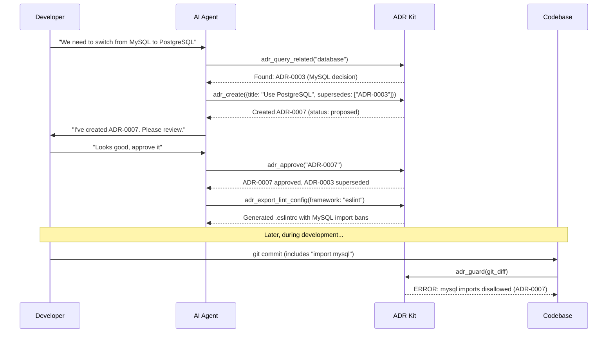

# ADR Kit

**AI-First Architectural Decision Records** - A toolkit designed for autonomous AI agents to manage ADRs in MADR format with rich contextual understanding and workflow automation.

[](https://www.python.org/downloads/)
[](https://opensource.org/licenses/MIT)

## 🤖 AI-First Design

ADR Kit is purpose-built for AI agents like **Claude Code** to autonomously manage architectural decisions. It provides "dumb but reliable" infrastructure that enforces standards and enables controlled AI agent operation through rich MCP (Model Context Protocol) tools.

## ✨ Features

- **🧠 Comprehensive MCP Server** with 18 AI-optimized tools for autonomous operation
- **🏗️ Three-Phase Architecture** - Contract → Gate → Context for complete AI governance
- **📋 Constraints Contract** - Single source of truth from all accepted ADR policies  
- **🚪 Preflight Policy Gate** - Proactive decision interception before implementation
- **🧠 Planning Context Service** - Curated architectural intelligence for agents
- **🔄 Enforced Workflow** - Query → Create → Approve → Supersede with validation
- **🔍 Semantic Search** - Vector-based intelligent ADR discovery and matching
- **📝 MADR-compliant** ADR creation, validation, and policy enforcement
- **⚡ Policy Guard System** - Automated code analysis for ADR policy violations
- **🛡️ Immutability Protection** - Content digests and tamper detection for approved ADRs
- **📊 Multi-format Indexing** - JSON and SQLite with automatic relationship tracking
- **🎯 Structured Policies** - Extract and enforce architectural decisions as lint rules
- **🌐 Static Site Generation** - Beautiful documentation via Log4brains integration
- **🤖 AI-First Design** - Rich contextual guidance for autonomous coding agents

## 🚀 Quick Start

### 1. Installation

```bash
# Install ADR Kit in your project
pip install adr-kit

# For semantic search (optional but recommended)
pip install sentence-transformers
```

### 2. Initialize in Your Project

```bash
# Set up ADR structure
cd your-project
adr-kit init

# Start the MCP server for AI integration
adr-kit mcp-server
```

### 3. AI Agent Integration

**For Cursor/Claude Code** - Add to your MCP settings.json:
```json
{
  "mcpServers": {
    "adr-kit": {
      "command": "adr-kit",
      "args": ["mcp-server"],
      "env": {}
    }
  }
}
```

**Then in your AI chat:**
- "Help me create an ADR for switching to React"
- "Check if we have any database-related architectural decisions"
- "Generate lint rules from our ADRs"

### MCP Tools Available for AI Agents

AI agents have access to 18 comprehensive tools organized by the three-phase architecture:

**Phase 1: Constraints Contract System**
- **`adr_contract_build()`** - Build constraints contract from accepted ADRs
- **`adr_contract_status()`** - Get contract status and summary statistics  
- **`adr_policy_merge()`** - Preview how policies would merge before creating ADRs

**Phase 2: Preflight Policy Gate**  
- **`adr_preflight()`** - Check if technical choice requires ADR approval
- **`adr_gate_status()`** - Get policy gate configuration and statistics
- **`adr_gate_config()`** - Update gate policies and technical choice mappings

**Phase 3: Planning Context Service**
- **`adr_planning_context()`** - Get curated architectural context for tasks
- **`adr_planning_bulk()`** - Generate context for multiple related tasks  
- **`adr_context_status()`** - Get planning context service status

**Core ADR Workflow Tools:**
- **`adr_init()`** - Initialize ADR system in repository
- **`adr_query_related()`** - Find related ADRs before making decisions  
- **`adr_create()`** - Create new ADRs with rich context
- **`adr_approve()`** - Approve proposed ADRs with immutability protection
- **`adr_supersede()`** - Replace existing decisions with automatic relationship management
- **`adr_validate()`** - Validate ADRs for compliance and policy requirements

**Advanced AI Tools:**
- **`adr_semantic_index()`** - Build vector embeddings for intelligent ADR discovery
- **`adr_semantic_match()`** - Find semantically similar ADRs using vector search
- **`adr_guard()`** - Analyze code changes for ADR policy violations

**Infrastructure Tools:**
- **`adr_index()`** - Generate JSON/SQLite indexes with relationship tracking
- **`adr_export_lint_config()`** - Generate ESLint/Ruff configs from ADR policies
- **`adr_render_site()`** - Build static documentation site

### Manual CLI (Legacy)

Basic commands still available for manual use:

```bash
# Initialize structure
adr-kit init

# Show available tools  
adr-kit info

# Validate existing ADRs
adr-kit validate
```

## 🔄 AI-First Workflow with Three-Phase Architecture

### Phase 1: Constraints Contract - "What are the rules?"
1. **Build contract**: `adr_contract_build()` creates single source of truth from all accepted ADRs
2. **Check status**: Contract includes all current policies, conflicts resolved with "deny beats allow"

### Phase 2: Preflight Policy Gate - "Is this allowed?"  
3. **Gate check**: `adr_preflight("postgresql")` - check if database changes require ADR approval
4. **Decision routing**: ALLOWED → proceed | REQUIRES_ADR → create proposal | BLOCKED → show conflict

### Phase 3: Planning Context - "What should I know?"
5. **Get context**: `adr_planning_context()` provides curated list of relevant ADRs + guidance
6. **Smart filtering**: Returns only relevant decisions, constraints, and contextual guidance

### Standard ADR Workflow
7. **Create proposed ADR**: AI drafts decision with full architectural context  
8. **Human review**: Developer reviews and approves the proposal
9. **Contract refresh**: System automatically rebuilds contract with new policies
10. **Generate enforcement**: Lint rules and guards updated automatically

## 🛠️ Manual Usage (Optional)

When not using AI agents, you can use the CLI directly:

```bash
# Initialize ADR structure
adr-kit init

# Validate all ADRs
adr-kit validate

# Generate static documentation site
adr-kit render-site
```

## 📚 Python API

```python
from adr_kit import parse_adr_file, validate_adr

# Parse and validate an ADR
adr = parse_adr_file("docs/adr/ADR-0001-example.md")
result = validate_adr(adr)

if result.is_valid:
    print(f"✅ {adr.title} is valid")
else:
    for issue in result.errors:
        print(f"❌ {issue.message}")
```

## 🤖 How It Works: AI Agent Workflow



## 💡 Value Proposition

**For Development Teams:**
- **Prevent Architectural Drift** - Automatically catch violations before code review
- **Enforce Decisions** - Turn ADRs into actionable lint rules and policies  
- **Find Related Decisions** - Semantic search prevents duplicate or conflicting ADRs
- **Maintain Context** - Rich documentation with automatic relationship tracking

**For AI Agents:**
- **Structured Decision Making** - Clear workflow prevents invalid architectural changes
- **Autonomous Operation** - Rich contextual guidance enables self-directed ADR management
- **Conflict Prevention** - Mandatory checks before creating potentially conflicting decisions
- **Standards Enforcement** - Automatic validation ensures compliance without human oversight

## 📋 ADR Format

ADRs use MADR format with YAML front-matter:

```markdown
---
id: ADR-0001
title: Use React Query for data fetching
status: accepted
date: 2025-09-03
deciders: [frontend-team, tech-lead]  
tags: [frontend, data, api]
supersedes: [ADR-0003]
superseded_by: []
policy:
  imports:
    disallow: [axios, fetch]
    prefer: [react-query, @tanstack/react-query]
  boundaries:
    layers:
      - name: view
      - name: service
      - name: data
    rules:
      - forbid: "view -> data"
  python:
    disallow_imports: []
  rationales: ["Standardize data fetching", "Prevent direct API calls from components"]
---

# Context

What is the context of this decision? What problem are we trying to solve?

# Decision

What is the change that we're proposing or doing?

# Consequences

What are the positive and negative consequences of this decision?

## Positive

- Standardized data fetching
- Built-in caching and background updates
- Excellent developer experience

## Negative  

- Additional dependency
- Learning curve for team

# Alternatives

What other alternatives have been considered?

- **Native fetch()**: Simple but lacks caching
- **Axios**: Good HTTP client but no query management
- **SWR**: Similar features but smaller ecosystem
```

## 🔧 Configuration

### Validation Rules

ADR Kit enforces these validation rules:

- **Schema validation** against JSON Schema
- **ID format**: `ADR-NNNN` (4-digit zero-padded)
- **Required fields**: `id`, `title`, `status`, `date`
- **Status values**: `proposed`, `accepted`, `superseded`, `deprecated`
- **Semantic rules**: Superseded ADRs must have `superseded_by`

### Directory Structure

```
your-project/
├── docs/adr/                    # ADR files
│   ├── ADR-0001-example.md
│   ├── ADR-0002-another.md  
│   └── adr-index.json          # Generated JSON index
├── .project-index/             # Optional SQLite catalog
│   └── catalog.db
└── .eslintrc.adrs.json        # Generated lint rules
```

## 🤖 AI Agent Benefits

- **🏗️ Three-Phase Intelligence** - Contract → Gate → Context provides complete architectural governance
- **🧠 Standardized Interface** - 18 comprehensive MCP tools with consistent behavior
- **📋 Constraints Contract** - Single source of truth eliminates policy conflicts and ambiguity
- **🚪 Preflight Gate** - Proactive decision routing prevents architectural drift before it starts  
- **🧠 Planning Context** - Curated, token-efficient guidance tailored to specific tasks
- **🔄 Enforced Workflow** - Prevents invalid architectural decisions and ensures compliance  
- **⚡ Built-in Guardrails** - Mandatory conflict detection prevents inconsistent decisions
- **💡 Rich Context** - Detailed guidance enables autonomous operation with minimal human oversight
- **📋 Automatic Management** - Handles complex relationship logic and validation reliably

## 🔗 Integration

### Pre-commit Hooks

Add to `.pre-commit-config.yaml`:

```yaml
repos:
  - repo: local
    hooks:
      - id: adr-validate
        name: Validate ADRs
        entry: adr-kit validate
        language: system
        pass_filenames: false
```

### GitHub Actions

```yaml
name: ADR Validation
on: [pull_request, push]

jobs:
  validate-adrs:
    runs-on: ubuntu-latest
    steps:
      - uses: actions/checkout@v4
      - uses: actions/setup-python@v5
        with:
          python-version: "3.12"
      - run: pip install adr-kit
      - run: adr-kit validate
      - run: adr-kit index --out docs/adr/adr-index.json
```

### Policy Enforcement Examples

ADR Kit automatically extracts and enforces policies from your architectural decisions:

**Structured Policy Definition:**
```yaml
# In ADR front-matter
policy:
  imports:
    disallow: [moment, jquery, lodash]
    prefer: [date-fns, dayjs]
  boundaries:
    layers:
      - name: view
      - name: service  
      - name: data
    rules:
      - forbid: "view -> data"
  python:
    disallow_imports: [flask, django]
  rationales: ["Modern lightweight libraries", "Enforce layered architecture"]
```

**Generated ESLint Config:**
```json
{
  "rules": {
    "no-restricted-imports": [
      "error", 
      {
        "paths": [
          {"name": "moment", "message": "Use date-fns instead (ADR-0001)"},
          {"name": "jquery", "message": "Use native DOM APIs (ADR-0001)"}
        ]
      }
    ]
  }
}
```

**Generated Ruff Config:**
```toml
[tool.ruff.flake8-banned-api]
banned-api = [
    "flask = Use FastAPI instead (ADR-0001)",
    "django = Use FastAPI instead (ADR-0001)"
]
```

**Real-time Policy Guard:**
```bash
# In your git workflow
git diff | adr-kit guard  # Catches violations before commit
```

## 📚 Learn More

- **Example ADR**: See [`docs/adr/ADR-0001-sample.md`](docs/adr/ADR-0001-sample.md) for a complete example with policies
- **MADR Format**: Based on the [Markdown ADR](https://adr.github.io/madr/) specification
- **MCP Protocol**: Integrates with [Model Context Protocol](https://modelcontextprotocol.io) for AI agents

## 📄 License

MIT License - see the [LICENSE](LICENSE) file for details.