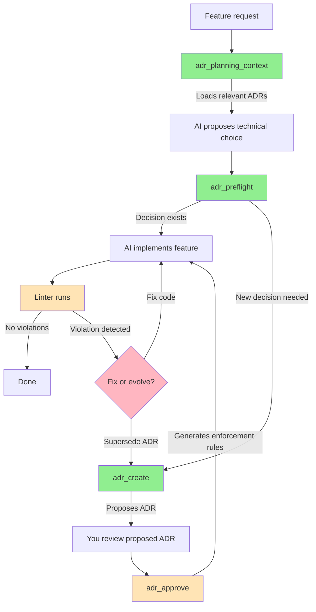
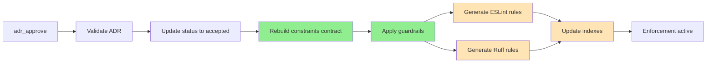

# ADR Kit

Keep AI agents architecturally consistent.

[](https://www.python.org/downloads/)
[](https://opensource.org/licenses/MIT)
[](#reliability--testing)

> **👥 For users:** Install ADR Kit in your project → [Quick Start](#quick-start)
> **🔧 For contributors:** Develop on ADR Kit itself → [CONTRIBUTING.md](CONTRIBUTING.md)

## The Concept of Architectural Decision Records

**The core idea**: When multiple people work on the same project, they need to align on significant technical choices. When the team agrees on a decision—React over Vue, PostgreSQL over MongoDB, microservices over monolith—they document it as an Architectural Decision Record:

- **Context**: Why was this decision needed?
- **Decision**: What did we choose?
- **Consequences**: What are the trade-offs?
- **Alternatives**: What did we reject and why?

**The team alignment mechanism**: Once a decision is recorded, everyone must either follow it or propose a new decision to be discussed with the team. ADRs also maintain a track record of how decisions evolved—when they were superseded, why they changed.

**How this works in practice**: New team members read the ADRs once during onboarding to understand what was agreed upon. Existing members don't read them every morning—they just know the decisions exist and can check back when needed because they've been working in the codebase for a while.

**The problem this concept solves**: Without written agreements, architectural consistency erodes. Team members make conflicting choices because they don't know what was already decided.

**The benefit**: ADRs create explicit team agreements with historical context that survive beyond individual memory and onboard new members effectively.

This concept has proven valuable for human teams. Now we're in the era of AI-driven development, where the problem is similar but fundamentally different in how it needs to be solved.

## The AI-Driven Development Challenge

**The similar problem**: Like human teams, we need architectural consistency across work sessions. Each new chat with your AI agent (Cursor, Claude Code, Copilot) is like onboarding a fresh team member with blank context.

**The key difference from human teams**:

In a **human team**, new members:
- Read all ADRs once during onboarding
- Remember they exist from working in the codebase
- Check back when needed because they have context

In **AI-driven development**, each chat:
- Starts with blank context (sometimes project info is preloaded, but generally it's a fresh start)
- Cannot read all ADRs like a human—that would waste valuable context window
- Would be "tired by the end of the context window" before even starting to solve the actual problem
- Needs only the relevant decisions for the current challenge, at the right point in time

**The second problem: ADRs don't exist yet**: Most projects don't have Architectural Decision Records at all. They were never created because manual ADR maintenance was too much overhead for human teams.

**Result without selective context loading**:
- **Monday**: "Use React Query" → Implements with React Query
- **Wednesday**: New chat, new context → Uses axios (no memory of Monday)
- **Friday**: Different conversation → Uses fetch() (different approach again)

The ADR concept solves the alignment problem, but AI-driven development requires a different approach: decisions must be created automatically, maintained as they evolve, and loaded selectively into context only when needed for the current challenge.

## ADR Kit: Introducing ADRs for AI-Driven Development

ADR Kit brings the proven ADR concept to AI-driven development, adapting how it works to solve the challenges we just outlined:

Instead of humans reading all ADRs once during onboarding, ADR Kit **selectively loads only relevant ADRs** into AI context at decision time. Instead of humans maintaining ADRs manually, **AI agents create and maintain them automatically**. The concept stays the same—session alignment on architectural decisions—but the implementation changes for the reality of AI agents.

**Works for both existing and new projects**: Whether you're working with an existing codebase (brownfield) or starting fresh (greenfield), ADR Kit adapts to your situation. Brownfield projects need initial discovery of implicit decisions and may require migration work for conflicts. Greenfield projects can create ADRs from the start, avoiding drift entirely. Both use the same three-layer mechanism.

Here's how ADR Kit solves three interconnected problems:

**1. ADR Lifecycle Management** - During every chat session, AI detects when a decision has architectural relevance. It checks: "Do we have an ADR for this?" If not, it proposes creating one. If yes, it loads the context to apply it—or challenges whether the decision needs to evolve. The AI manages the full lifecycle: create new ADRs, supersede outdated ones, and maintain them as your architecture evolves. This happens continuously, not just during initial setup.

**2. Context at the Right Time** - No matter how good the AI model, it needs the right context at the right time to make decisions. ADR Kit surfaces relevant ADRs automatically when needed—before the AI reasons about solutions. Not all ADRs dumped into context, only the relevant ones, only when needed. This is fundamental to AI-driven development.

**3. Enforcement with Feedback Loop** - Even when AI receives context, it can make mistakes or ignore constraints. Automated enforcement (linting, CI checks) catches violations and provides direct feedback explaining why it violates the agreed-upon decision. This triggers management: either fix the code to comply, or supersede the ADR with a new decision if it needs to evolve. The whole mechanism—create, maintain, enforce, feedback—is baked into ADR Kit.

### How This Works: Three-Layer Approach

ADR Kit introduces ADRs to your project with three active layers:

**Layer 1: ADR Lifecycle Management** - Continuous detection and management during chat sessions
- AI detects architectural relevance: "This decision seems architecturally significant"
- Checks: "Do we have an ADR for this already?"
- If not: Proposes creating new ADR
- If yes: Loads context to apply it, or challenges if decision needs to evolve
- Manages full lifecycle: Create, supersede outdated decisions, maintain as architecture evolves
- Quality gate: Reject vague decisions ("use a modern framework") that can't be enforced
- Works continuously: Not just initial setup, but every chat session where architectural decisions emerge

**Layer 2: Context at the Right Time** - Surface relevant information when decisions are being made
- Task: "Implement authentication" → Automatically loads ADR-0005 (Auth0), ADR-0008 (JWT structure)
- Filters by relevance: Only 3-5 relevant ADRs, never all 50—don't blow the context window
- Timing: Before AI reasons about solutions, while it's making decisions
- Automation: ADR Kit ensures relevant context is always surfaced when needed, regardless of which AI agent you use
- Goal: Right information, right time, every time—no matter how good the model is

**Layer 3: Enforcement with Feedback Loop** - Catch violations and trigger management
- Approved ADRs → ESLint/Ruff rules automatically generated
- Developer (or AI) violates constraint → Linter blocks with ADR reference and explanation
- Feedback triggers decision: Fix code to comply, or supersede the ADR if decision needs to evolve
- Works independent of whether context was loaded or AI made a mistake
- Completes the cycle: violations feed back into management (maintain or supersede)

### Integration into AI-Driven Development Cycle

ADR Kit integrates into your AI development workflow at critical decision points:


```mermaid
graph TD
    Request[Feature request] --> Context[adr_planning_context]
    Context -->|Loads relevant ADRs| Choice[AI proposes technical choice]
    Choice --> Preflight[adr_preflight]
    Preflight -->|Decision exists| Implement[AI implements feature]
    Preflight -->|New decision needed| Create[adr_create]
    Create -->|Proposes ADR| Review[You review proposed ADR]
    Review --> Approve[adr_approve]
    Approve -->|Generates enforcement rules| Implement
    Implement --> Linter[Linter runs]
    Linter -->|No violations| Done[Done]
    Linter -->|Violation detected| Feedback{Fix or evolve?}
    Feedback -->|Fix code| Implement
    Feedback -->|Supersede ADR| Create

    style Context fill:#90EE90
    style Preflight fill:#90EE90
    style Create fill:#90EE90
    style Approve fill:#FFE4B5
    style Linter fill:#FFE4B5
    style Feedback fill:#FFB6C1
```

**The complete cycle**: Violations aren't dead ends—they feed back into ADR management. Either fix the code to comply, or supersede the decision with a new ADR. The whole mechanism—create, serve context, enforce, provide feedback—is baked into one system.

## Quick Start

### Install

```bash
uv tool install adr-kit
```

### Setup Your Project

```bash
cd your-project
adr-kit init                    # Creates docs/adr/ directory
adr-kit setup-cursor            # or setup-claude for Claude Code
```

This connects ADR Kit to your AI agent via MCP (Model Context Protocol).

### Start Using It

Once set up, ADR Kit works in every chat session — whether your project is new or established:

```
You: "Let's use FastAPI for the backend API"
AI: [Calls adr_preflight({choice: "fastapi"})]
AI: "No existing ADR. I'll propose one for FastAPI."
AI: [Calls adr_create()] → Proposes ADR-0001 (status: proposed)
AI: "Here's the proposed ADR-0001. Review it?"
You: "Looks good, approve it"
AI: [Calls adr_approve()] → Enforcement now active
```

The AI detects architectural decisions as you work, proposes ADRs, and you review and approve. It also catches decisions made implicitly — like noticing you're importing React everywhere and suggesting to document it.

<details>
<summary><b>Existing codebase? Start with project analysis</b></summary>

If you have an existing project, let the AI discover the architectural decisions already baked into your code:

```
You: "Analyze my project for architectural decisions"
AI: [Calls adr_analyze_project()]
AI: "If I'm reading this correctly, you're using React, TypeScript, PostgreSQL, Docker"
AI: "I also found a potential conflict: PostgreSQL is used in 80% of the code,
     but MySQL appears in the legacy module. Should I document both or propose
     migrating to consistent PostgreSQL usage?"
```

Review the proposed ADRs, approve the ones that accurately reflect your decisions:

```
You: "Approve ADR-0001 through ADR-0003. For the database conflict, let's
     document PostgreSQL as the standard and create a migration plan for the
     legacy module."
AI: [Calls adr_approve() for each, notes the migration decision]
```

Now your implicit decisions are explicit, documented, and enforced. From this point forward, the workflow is the same as above — AI references these ADRs when implementing features and ADR Kit blocks violations.

</details>

## How It Works: Technical Deep Dive

This section explains the mechanics of each layer with concrete examples.

### Layer 1: ADR Lifecycle Management (Continuous Detection & Evolution)

**The Problem**: Architectural decisions emerge during development, but without active management they're never documented or maintained as they evolve.

**The Solution**: AI continuously detects architectural relevance during chat sessions → Checks for existing ADRs → Proposes creating them. The creation flow is covered in [Quick Start](#quick-start) above. This section focuses on what happens after: evolution and quality control.

**When a decision needs to evolve** (supersede, never update):

ADRs are immutable records. When a decision needs to change, you supersede it with a new ADR — the old one stays as historical record.

```
You: "Actually, we need axios for this specific external API integration"
AI: [Detects conflict with ADR-0003: Use React Query]
AI: "This conflicts with ADR-0003. ADRs are immutable records, so we have two options:
     A) Find a React Query solution that works here
     B) Supersede ADR-0003 with a new decision that allows axios for external APIs"
You: "Option B"
AI: [Calls adr_supersede()] → Proposes ADR-0015, marks ADR-0003 as superseded
AI: "ADR-0015 allows axios for external API integrations while keeping React Query
     as default. Note: 3 existing files use React Query for external calls —
     these would need to migrate to axios for consistency with the new decision."
```

Superseding always surfaces migration implications — the AI identifies what existing code needs to change to align with the new decision.

**Quality Gate**: ADR Kit ensures decisions are specific enough to enforce:
- ❌ "Use a modern framework" → Rejected (too vague)
- ✅ "Use React 18. Don't use Vue or Angular." → Accepted (specific, has constraints)

**Continuous operation**: This layer works throughout development, not just during initial setup. Every chat session where architectural decisions emerge triggers this detection and management cycle.

### Layer 2: Context Loading (Right Information, Right Time)

**The Problem**: AI can't remember decisions from previous conversations.

**The Solution**: Before implementing features, AI asks "what architectural constraints apply here?"

```
Task: "Implement user authentication"
Domain: backend, security

ADR Kit returns:
✅ ADR-0005: Use Auth0 for Authentication
   - Constraint: Don't implement custom auth
   - Warning: ⚠️ Rate limiting required on auth endpoints

✅ ADR-0008: JWT Token Structure
   - Constraint: Access tokens expire in 1 hour
   - Constraint: Refresh tokens stored in httpOnly cookies

Filtered out (not relevant):
❌ ADR-0001: React Query (frontend)
❌ ADR-0012: CSS-in-JS (styling)
```

**How**: `adr_planning_context` tool filters ADRs by task relevance, surfaces warnings from ADR consequences, returns only 3-5 relevant decisions instead of flooding context with all 50 ADRs.

### Layer 3: Enforcement with Feedback Loop

**The Problem**: Even with documentation, AI can make mistakes or forget context.

**The Solution**: Approved ADRs become automated lint rules that provide feedback.

```yaml
# ADR-0003: Use React Query for data fetching
policy:
  imports:
    prefer: [react-query, @tanstack/react-query]
    disallow: [axios]
```

Automatically generates:

```json
// .eslintrc.adrs.json (auto-generated, don't edit)
{
  "rules": {
    "no-restricted-imports": [
      "error",
      {
        "paths": [{
          "name": "axios",
          "message": "Use React Query instead (ADR-0003)"
        }]
      }
    ]
  }
}
```

**Enforcement with Feedback**:
```javascript
import axios from 'axios';  // ❌ ESLint error: Use React Query instead (ADR-0003)
```

When this violation is caught, it triggers a decision:
- **Fix the code**: Change to React Query (maintain consistency)
- **Supersede the ADR**: If the decision needs to evolve — create a new ADR that replaces the old one (e.g., "Allow axios for external API integrations"), then migrate existing code to match the new decision

The feedback loop is complete: violations aren't dead ends—they feed back into ADR management. Either fix to comply, or supersede the architectural decision. ADRs are immutable records — they're never edited, only superseded by new decisions.

**Current Support**: ESLint (JavaScript/TypeScript), Ruff (Python)
**Future**: More linters, runtime checks, CI gates

## The 6 MCP Tools

AI agents interact with ADR Kit through 6 tools. Each tool implements one part of the three-layer system:

| Tool | Layer | When AI Uses It | What It Does |
|------|-------|-----------------|--------------|
| `adr_analyze_project` | Layer 1 | Starting with existing codebase | Detects tech stack, proposes ADRs for existing decisions |
| `adr_preflight` | Layer 1 | Before making technical choice | Returns ALLOWED/REQUIRES_ADR/BLOCKED based on existing decisions |
| `adr_create` | Layer 1 | Documenting a decision | Proposes ADR file (status: proposed) with quality validation and conflict detection |
| `adr_approve` | Layer 3 | After human review | Activates enforcement: generates lint rules, updates indexes |
| `adr_supersede` | Layer 1 | Replacing existing decision | Creates new ADR, marks old one as superseded |
| `adr_planning_context` | Layer 2 | Before implementing feature | Returns relevant ADRs filtered by task + domain, includes warnings |

### The Approval Automation Pipeline

When you approve an ADR, this happens automatically:


```mermaid
graph LR
    Approve[adr_approve] --> Validate[Validate ADR]
    Validate --> Status[Update status to accepted]
    Status --> Contract[Rebuild constraints contract]
    Contract --> Guardrails[Apply guardrails]
    Guardrails --> ESLint[Generate ESLint rules]
    Guardrails --> Ruff[Generate Ruff rules]
    ESLint --> Index[Update indexes]
    Ruff --> Index
    Index --> Done[Enforcement active]

    style Contract fill:#90EE90
    style Guardrails fill:#90EE90
    style ESLint fill:#FFE4B5
    style Ruff fill:#FFE4B5
    style Index fill:#FFE4B5
```

**No manual steps required**. Index generation, lint rule creation, and config updates all happen automatically.

### Decision Quality Assistance

ADR Kit helps you write better architectural decisions by providing guidance **before** creating ADR files:

**The Problem**: Vague decisions like "use a modern framework" can't be enforced. Without specificity and explicit constraints, your ADRs become documentation-only.

**The Solution**: ADR Kit evaluates decision quality and provides specific feedback:

```
❌ Vague: "Use a modern framework with good performance"
   → Feedback: "Specify exact framework name and version"

✅ Specific: "Use React 18 with TypeScript 5.0"
```

**What Gets Evaluated**:
- **Specificity**: Are technologies and versions named concretely?
- **Trade-offs**: Are both pros AND cons documented?
- **Context**: Why is this decision needed right now?
- **Constraints**: Are there explicit "don't use X" policies?
- **Alternatives**: What options were rejected and why?

**User Experience**:
1. AI agent drafts an ADR based on your requirements
2. ADR Kit provides quality feedback with specific suggestions
3. Agent revises and improves the decision
4. Once quality passes, the ADR file is created

**How This Helps**:

Weak ADRs can't be enforced. "Use a modern framework" doesn't tell a linter what to block. ADR Kit's quality feedback pushes toward specific, actionable decisions that can be translated into automated policies.

## How ADRs Get Their Policies

ADR Kit uses a **two-step creation flow**. You don't write ADRs or policies manually — the AI agent handles both, guided by ADR Kit:

**Step 1 — Decision Quality**: When the agent calls `adr_create`, ADR Kit evaluates the decision for specificity, trade-offs, and enforceability. Vague decisions ("use a modern framework") are rejected with actionable feedback before any file is created.

**Step 2 — Policy Construction**: ADR Kit returns a `policy_guidance` promptlet that walks the agent through mapping the decision text into structured policies. The agent reasons about what constraints to extract and constructs the policy block.

The result is an ADR with both human-readable documentation and machine-readable enforcement policies — written by the AI, reviewed by you.

### ADR Format

ADRs use [MADR format](https://adr.github.io/madr/) with a `policy` block in the front-matter for enforcement:

```markdown
---
id: ADR-0001
title: Use React Query for data fetching
status: proposed
date: 2025-10-01
deciders: [frontend-team, tech-lead]
tags: [frontend, data-fetching]
policy:
  imports:
    prefer: [react-query, @tanstack/react-query]
    disallow: [axios]
  rationales:
    - "Standardize data fetching patterns"
---

## Context
Custom data fetching is scattered across components...

## Decision
Use React Query for all data fetching. Don't use axios directly.

## Consequences
### Positive
- Standardized caching, built-in loading states
### Negative
- Additional dependency, learning curve
```

After approval, this automatically generates lint rules:

```json
// .eslintrc.adrs.json (auto-generated, don't edit)
{
  "rules": {
    "no-restricted-imports": ["error", {
      "paths": [{
        "name": "axios",
        "message": "Use React Query instead (ADR-0001)"
      }]
    }]
  }
}
```

### Policy Types

The `policy` block supports five types of enforcement:

| Type | What It Enforces | Example |
|------|-----------------|---------|
| `imports` | Library restrictions | `disallow: [axios]`, `prefer: [react-query]` |
| `python` | Python-specific imports | `disallow_imports: [flask, django]` |
| `patterns` | Code pattern rules | Named rules with regex or structured queries, severity levels |
| `architecture` | Layer boundaries + required structure | `rule: "ui -> database"`, `action: block` |
| `config_enforcement` | Tool configuration | TypeScript tsconfig settings, Python ruff/mypy settings |
| `rationales` | Reasons for policies | `["Native async support required"]` |

<details>
<summary><b>Full policy schema reference</b></summary>

```yaml
policy:
  imports:
    disallow: [string]           # Libraries/packages to ban
    prefer: [string]             # Recommended alternatives

  python:
    disallow_imports: [string]   # Python-specific module bans

  patterns:
    patterns:
      rule_name:                 # Named pattern rules (dict)
        description: string      # Human-readable description
        language: string         # python, typescript, etc.
        rule: string | object    # Regex string or structured query
        severity: error | warning | info
        autofix: boolean         # Whether autofix is available

  architecture:
    layer_boundaries:            # Access control between layers
      - rule: string             # Format: "layer -> layer" (e.g., "ui -> database")
        check: string            # Path pattern to check (glob)
        action: block | warn     # How to enforce
        message: string          # Custom error message
    required_structure:          # Required files/directories
      - path: string             # Required path (glob supported)
        description: string      # Why this is required

  config_enforcement:
    typescript:
      tsconfig: object           # Required tsconfig.json settings
    python:
      ruff: object               # Required Ruff configuration
      mypy: object               # Required mypy configuration

  rationales: [string]           # Reasons for the policies
```

</details>

### Example ADRs

See [tests/fixtures/examples/](tests/fixtures/examples/) for complete examples:
- `good-adr-with-structured-policy.md` — Full policy block in front-matter
- `bad-adr-no-policy.md` — No enforceable constraints (triggers quality gate)

## AI Agent Integration

### Setup for Cursor IDE

```bash
# Automatic configuration
adr-kit setup-cursor
```

Or manually add to `.cursor/mcp.json`:
```json
{
  "mcpServers": {
    "adr-kit": {
      "command": "adr-kit",
      "args": ["mcp-server"]
    }
  }
}
```

### Setup for Claude Code

```bash
# Automatic configuration
adr-kit setup-claude
```

Or manually add to Claude Code MCP settings.

## Manual CLI Usage (Without AI)

For direct usage without AI agents:

```bash
# Validation
adr-kit validate                # Validate all ADRs
adr-kit validate --id ADR-0001  # Validate specific ADR

# Policy management
adr-kit contract-build          # Build constraints contract
adr-kit contract-status         # View current contract
adr-kit preflight postgresql    # Manual preflight check

# Enforcement
adr-kit guardrail-apply        # Apply lint rules
adr-kit guardrail-status       # Check guardrail status

# Maintenance
adr-kit update                  # Check for updates
adr-kit mcp-health             # Test MCP server
```

## Advanced: What's Automatic vs Manual

### Automatic (Triggered by Approval)

When you call `adr_approve()` or AI agent approves an ADR:
- ✅ Index generation (`generate_adr_index()`)
- ✅ ESLint rule generation (`generate_eslint_config()`)
- ✅ Ruff rule generation (`generate_ruff_config()`)
- ✅ Guardrail application (`GuardrailManager.apply_guardrails()`)
- ✅ Constraints contract rebuild (`ConstraintsContractBuilder.build()`)
- ✅ Codebase validation

**You never manually call these functions**. They're internal to the approval workflow.

### Manual (When Needed)

- 🔧 Project initialization (`adr-kit init`)
- 🔧 Validation (`adr-kit validate`)
- 🔧 Health checks (`adr-kit mcp-health`)
- 🔧 Manual preflight checks (`adr-kit preflight <choice>`)

## Advanced: Semantic Search

ADR Kit includes built-in semantic search for finding related ADRs:

**Status**: Fully implemented, currently used as optional fallback
- Uses sentence-transformers (`all-MiniLM-L6-v2`)
- Stores embeddings in `.project-index/adr-vectors/`
- Finds ADRs by meaning, not just keywords

**Current behavior**: Primary method is keyword matching, semantic search available as enhancement

**Future**: Will become primary method for conflict detection

## Directory Structure

```
your-project/
├── docs/adr/                      # ADR files
│   ├── ADR-0001-react-query.md
│   ├── ADR-0002-typescript.md
│   └── adr-index.json            # Auto-generated index
├── .adr-kit/                     # System files
│   └── constraints_accepted.json  # Merged policies
├── .project-index/               # Indexes
│   └── adr-vectors/              # Semantic search embeddings (optional)
├── .eslintrc.adrs.json           # Auto-generated lint rules
└── pyproject.toml                # Auto-managed [tool.ruff] section
```

**Important**: Files in `.adr-kit/` and `.eslintrc.adrs.json` are auto-generated. Don't edit them manually.

## Installation Options

### Recommended: Global Install

```bash
uv tool install adr-kit
```

Use ADR Kit across all your projects. The `adr-kit` command is available system-wide.

### Virtual Environment Install

```bash
cd your-project
uv venv
source .venv/bin/activate
uv pip install adr-kit
```

Project-specific installation.

### Quick Trial (No Install)

```bash
uvx adr-kit --help
uvx adr-kit init
```

Try ADR Kit without installing.

## CI/CD Integration

```yaml
# .github/workflows/adr.yml
name: ADR Validation

on: [push, pull_request]

jobs:
  validate:
    runs-on: ubuntu-latest
    steps:
      - uses: actions/checkout@v4

      - name: Install uv
        uses: astral-sh/setup-uv@v4
        with:
          enable-cache: true

      - name: Install ADR Kit
        run: uv tool install adr-kit

      - name: Validate ADRs
        run: adr-kit validate

      - name: Check lint rules are current
        run: git diff --exit-code .eslintrc.adrs.json
```

## Testing & Validation

ADR Kit includes comprehensive test coverage:

### Quick Health Check

```bash
adr-kit mcp-health
```

Expected output:
- ✅ FastMCP dependency: OK
- ✅ MCP server: OK
- ✅ Workflow backend system: OK
- 📡 6 MCP Tools available

### Reliability & Testing

ADR Kit is thoroughly tested across multiple scenarios:

- **Complete lifecycle flows**: Analyze → create → approve → enforce
- **Error handling**: Permission issues, malformed input, conflicts
- **Performance**: Large projects, memory efficiency
- **MCP integration**: AI agent communication

Each workflow is designed for predictable, reliable behavior.

## FAQ

**Q: I don't use AI agents. Is this useful for me?**
A: ADR Kit works standalone for documentation and manual enforcement setup. But it's designed for the AI development workflow. The CLI exists for testing and CI/CD, but the real value comes from AI integration.

**Q: Does this replace code reviews?**
A: No. ADR Kit catches architectural violations automatically (Layer 3), but code reviews catch logic errors, security issues, and design problems that lint rules can't detect. Think of it as an additional safety net.

**Q: What languages/frameworks are supported?**
A: **Layer 1 (lifecycle management)** and **Layer 2 (context loading)** are language-agnostic. **Layer 3 (enforcement)** currently supports JavaScript/TypeScript (ESLint) and Python (Ruff). Other languages require manual policy application until more linters are supported.

**Q: Can I use this with existing ADRs?**
A: Yes. ADR Kit reads standard MADR format. Add a `policy:` section to existing ADRs to enable automated enforcement.

**Q: What if my ADR doesn't map to lint rules?**
A: Not all architectural decisions can be enforced with linters. Example: "Use microservices architecture" can't become an ESLint rule. These decisions work at Layer 1 (lifecycle management) and Layer 2 (context loading) but not Layer 3 (enforcement). ADR Kit focuses on decisions that CAN be enforced: library choices, coding patterns, file structure.

**Q: Does this work offline?**
A: Yes. No external API calls. Semantic search uses local models (sentence-transformers). Your ADRs and policies stay on your machine.

**Q: What's the difference between MCP tools and CLI commands?**
A: **MCP tools** (6) are the AI interface—how agents interact with ADR Kit. **CLI commands** (20+) are for manual operations, debugging, and CI/CD. Most users interact through AI; the CLI exists for edge cases.

## Current Capabilities

**What ADR Kit Does Today:**

- ✅ **Context loading**: Filters ADRs by relevance to current task (planning_context tool)
- ✅ **Implicit decision discovery**: Reads codebase to discover architectural decisions already made but never documented (analyze_project tool)
- ✅ **Conflict detection**: Analyzes whether discovered decisions are consistently followed or violated in some cases
- ✅ **Greenfield support**: Create ADRs before or as you implement for strong foundation from the start
- ✅ **Policy extraction**: Converts decision text into enforceable policies (import restrictions)
- ✅ **ESLint/Ruff generation**: Creates lint rules from policies automatically
- ✅ **Quality gate**: Prevents vague decisions that can't be enforced

**Current Limitations:**

- Policy types: Import restrictions work well. Pattern policies, architecture boundaries, and config enforcement are defined but not yet enforced.
- Language support: JavaScript/TypeScript (ESLint) and Python (Ruff) today. Other languages require manual policy application.
- Enforcement: Linter-based only. Runtime enforcement and CI gates are planned.

## What's Coming

**Enforcement Pipeline** (High Priority):
- Staged enforcement system (warn → block transitions)
- Complete enforcement loop with automated code scanning
- Import-linter template generation for Python projects

**Developer Experience**:
- Enhanced semantic search as primary conflict detection method
- ADR templates for common decision types
- Static site generation for ADR documentation (Log4brains integration)

**Recent Additions** (Since Feb 2026):
- Decision quality guidance system
- Expanded policy types: patterns, architecture rules, config enforcement
- AI warning extraction for task-specific guidance
- Policy suggestion engine with auto-detection

See [GitHub Issues](https://github.com/kschlt/adr-kit/issues) and the project roadmap for detailed feature status.

## Learn More

- **MADR Format**: [Markdown ADR Specification](https://adr.github.io/madr/)
- **MCP Protocol**: [Model Context Protocol](https://modelcontextprotocol.io)
- **Getting Started Guide**: [GETTING_STARTED.md](GETTING_STARTED.md) *(coming soon)*
- **Workflows Deep Dive**: [WORKFLOWS.md](WORKFLOWS.md) *(coming soon)*
- **AI Integration Guide**: [AI_INTEGRATION.md](AI_INTEGRATION.md) *(coming soon)*
- **Core Concepts**: [CONCEPTS.md](CONCEPTS.md) *(coming soon)*

---

## License

MIT License - see [LICENSE](LICENSE) file for details.
