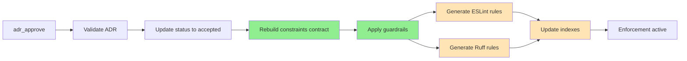

# ADR Kit

Document architectural decisions. Enforce them automatically.

[](https://www.python.org/downloads/)
[](https://opensource.org/licenses/MIT)
[](#testing--validation)

> **👥 For users:** Install ADR Kit in your project → [Quick Start](#quick-start)
> **🔧 For contributors:** Develop on ADR Kit itself → [Development](#development)

## The Problem

Your team decides "use React Query for all data fetching." Three months later, new code uses axios and fetch(). No one remembers the decision or why it was made. Code reviews catch some violations, but not all.

## The Solution

ADR Kit makes architectural decisions enforceable:

1. **Document decisions** in standard MADR format
2. **Extract policies** from decision documents automatically
3. **Generate lint rules** that prevent violations
4. **Integrate with AI agents** for autonomous ADR management

**Example**: An ADR that says `disallow: [axios]` becomes an ESLint rule that blocks axios imports with a message pointing to your ADR.

## Quick Start

### Install

```bash
uv tool install adr-kit
```

### Initialize Your Project

```bash
cd your-project
adr-kit init
```

### Choose Your Path

**Path A: Greenfield (New Project)**
Start creating ADRs as you make architectural decisions.

```bash
# Setup AI agent to help you
adr-kit setup-cursor  # or setup-claude

# Then in Cursor/Claude Code:
# "Create an ADR for our decision to use React with TypeScript"
```

**Path B: Brownfield (Existing Project)**
Analyze existing codebase to discover decisions already made.

```bash
# Setup AI agent
adr-kit setup-cursor  # or setup-claude

# Then in Cursor/Claude Code:
# "Analyze my project for architectural decisions that need ADRs"
# AI will detect your tech stack and propose ADRs
```

## How It Works

### Design Pattern: MCP Tools → Workflows → Internal Functions

```
AI Agent
  ↓
MCP Tool (6 simple interfaces)
  ↓
Workflow (multi-step automation)
  ↓
Internal Functions (automatic)
  ├─ generate_adr_index()
  ├─ generate_eslint_config()
  ├─ generate_ruff_config()
  ├─ apply_guardrails()
  └─ rebuild_contract()
```

**Why this matters**: When you approve an ADR, one MCP tool call triggers a 9-step automation pipeline. You don't manually generate indexes or lint rules—it all happens automatically.

### The 6 MCP Tools

ADR Kit exposes 6 MCP tools for AI agents. Each tool triggers a comprehensive workflow:

| MCP Tool | When To Use | What It Does |
|----------|-------------|--------------|
| `adr_analyze_project` | Starting with existing codebase | Detects technologies, proposes ADRs for existing decisions |
| `adr_preflight` | Before making technical choice | Returns ALLOWED/REQUIRES_ADR/BLOCKED |
| `adr_create` | Documenting a decision | Creates ADR file with conflict detection |
| `adr_approve` | After human review | **Triggers full automation**: contract rebuild, lint rules, guardrails, indexes |
| `adr_supersede` | Replacing existing decision | Manages relationships, updates old ADR to superseded |
| `adr_planning_context` | Before implementing feature | Returns relevant ADRs, constraints, technology recommendations |

### The Approval Automation Pipeline

When you approve an ADR, this happens automatically:



**No manual steps required**. Index generation, lint rule creation, and config updates all happen automatically.

## Writing ADRs for Constraint Extraction

ADR Kit can automatically extract constraints from your ADRs to provide architectural guidance to AI agents and developers. To enable this feature, your ADRs should include policy information in one of two formats:

### Approach 1: Structured Policy (Recommended)

Include a `policy` block in your ADR front-matter for reliable, machine-readable constraints:

```yaml
---
id: "ADR-0002"
title: "Use FastAPI as Web Framework"
status: proposed
policy:
  imports:
    disallow: ["flask", "django", "litestar"]
    prefer: ["fastapi"]
  python:
    disallow_imports: ["flask", "django"]
  rationales:
    - "FastAPI provides native async support required for I/O operations"
    - "Automatic OpenAPI documentation reduces maintenance burden"
---
```

**Benefits**:
- ✅ Reliable, explicit constraint extraction
- ✅ Machine-readable policies for automation
- ✅ Clear separation of concerns
- ✅ Works perfectly with `adr_planning_context` and `adr_preflight`

**Policy Schema**:
```typescript
{
  imports: {
    disallow: string[],  // Libraries/packages to ban
    prefer: string[]     // Recommended alternatives
  },
  python: {
    disallow_imports: string[]  // Python-specific module bans
  },
  boundaries: {
    rules: [{ forbid: string }]  // Architecture rules like "ui -> database"
  },
  rationales: string[]  // Reasons for the policies
}
```

### Approach 2: Pattern-Matching Language

Use specific phrases in your decision and consequences sections:

```markdown
## Decision

Use FastAPI as the backend web framework. **Don't use Flask** or Django
as they lack native async support. **Prefer FastAPI over Flask** for
this use case.

## Consequences

**Avoid** synchronous frameworks like Flask. Backend **should not use**
Django REST Framework for new services.
```

**Recognized patterns**:
- `Don't use X` / `Avoid X` / `X is deprecated`
- `Use Y instead of X` / `Prefer Y over X`
- `Layer A should not access Layer B`

**Benefits**:
- ✅ Natural language - reads well in documentation
- ✅ Works with existing ADRs without modification
- ✅ No schema knowledge needed

**Limitations**:
- ⚠️ Less reliable than structured policy
- ⚠️ May miss nuanced constraints
- ⚠️ Harder to validate programmatically

### When to Use Which Approach

| Scenario | Recommendation |
|----------|----------------|
| **New ADRs** (AI agents) | Structured policy - most reliable |
| **Existing ADRs** (manual) | Pattern language - easier to retrofit |
| **Critical constraints** | Structured policy - no ambiguity |
| **Documentation focus** | Pattern language - more readable |
| **Best of both** | Combine both approaches |

### Validation and Feedback

When creating ADRs through `adr_create`, ADR Kit validates policy completeness:

```json
{
  "validation_warnings": [
    "No structured policy provided and no pattern-matching language detected in content.
     Constraint extraction may not work. Consider adding a 'policy' block or using
     phrases like 'Don't use X' in your decision text.",
    "Suggested policy structure: {
      \"imports\": {
        \"disallow\": [\"flask\"],
        \"prefer\": [\"fastapi\"]
      }
    }"
  ]
}
```

If you receive this warning:
1. **Option A**: Add a structured `policy` block to your ADR front-matter
2. **Option B**: Update your decision/consequences text with pattern-friendly language
3. **Option C**: Accept that this ADR won't provide automated constraints (documentation only)

### Example ADRs

See [tests/fixtures/examples/](tests/fixtures/examples/) for complete examples:
- `good-adr-with-structured-policy.md` - FastAPI ADR with full policy schema
- `good-adr-with-pattern-language.md` - React Query ADR using patterns
- `bad-adr-no-policy.md` - PostgreSQL ADR without constraints (triggers warnings)

### Checking Constraint Extraction

Verify your ADRs have extractable constraints:

```python
# Via Python API
from adr_kit.core.policy_extractor import PolicyExtractor
from adr_kit.core.parse import parse_adr_file

adr = parse_adr_file("docs/adr/ADR-0001-fastapi.md")
extractor = PolicyExtractor()

if extractor.has_extractable_policy(adr):
    policy = extractor.extract_policy(adr)
    print(f"Disallowed: {policy.get_disallowed_imports()}")
    print(f"Preferred: {policy.get_preferred_imports()}")
else:
    print("⚠️  No extractable constraints found")
```

```bash
# Via MCP (AI agents use this automatically)
# The agent calls: adr_planning_context({
#   task_description: "Implement new API endpoint",
#   domain_hints: ["backend"]
# })
#
# Response includes extracted constraints:
# {
#   "constraints": [
#     "Use fastapi (ADR-0001)",
#     "Don't use flask (ADR-0001)"
#   ]
# }
```

## Example: Complete Lifecycle

### Greenfield (New Project)

```bash
# 1. Initialize
adr-kit init
adr-kit setup-cursor

# 2. Make a decision
# In Cursor: "I want to use React Query for data fetching"

# 3. AI calls adr_preflight({choice: "react-query"})
# Returns: REQUIRES_ADR (no existing ADR for this)

# 4. AI calls adr_create({title: "Use React Query", ...})
# Creates: docs/adr/ADR-0001-react-query.md (status: proposed)

# 5. You review the ADR
# In Cursor: "Approve ADR-0001"

# 6. AI calls adr_approve({adr_id: "ADR-0001"})
# Automatically:
#   - Updates status to "accepted"
#   - Rebuilds constraints contract
#   - Generates ESLint rules blocking axios
#   - Applies guardrails to .eslintrc.adrs.json
#   - Updates adr-index.json

# 7. Enforcement active
# Developer tries: import axios from 'axios'
# ESLint error: "Use React Query instead (ADR-0001)"
```

### Brownfield (Existing Project)

```bash
# 1. Initialize
cd existing-project
adr-kit init
adr-kit setup-cursor

# 2. Analyze existing architecture
# In Cursor: "Analyze my project for architectural decisions"

# 3. AI calls adr_analyze_project()
# Detects: React, TypeScript, Express, PostgreSQL, Docker
# Generates tech-specific analysis prompts

# 4. AI creates ADRs for existing decisions
# ADR-0001: Use React for Frontend
# ADR-0002: Use TypeScript for Type Safety
# ADR-0003: Use PostgreSQL for Data Storage
# ADR-0004: Use Docker for Containerization

# 5. You review all proposed ADRs
# In Cursor: "Approve ADR-0001 through ADR-0004"

# 6. AI approves each one (4 automation pipelines run)
# Now your existing decisions are documented AND enforced

# 7. Future decisions follow greenfield workflow
```

## Brownfield Analysis Details

ADR Kit includes sophisticated technology detection for brownfield projects:

**Detected Technologies** (20+):
- **Frontend**: React, Vue, Angular, Svelte
- **Backend**: Express.js, FastAPI, Django, Flask, Spring
- **Databases**: PostgreSQL, MySQL, MongoDB, Redis
- **Languages**: TypeScript, JavaScript, Python, Rust, Go
- **Tools**: Docker, Kubernetes

**How It Works**:
```python
# Scans for config files
package.json → Detects React, TypeScript, Express
requirements.txt → Detects FastAPI, PostgreSQL
Dockerfile → Detects Docker

# Generates technology-specific prompts
"React: Document component architecture, state management decisions"
"PostgreSQL: Document schema design, migration strategy"
"Docker: Document containerization approach"
```

**Different prompts based on existing ADRs**:
- **0 ADRs found** → "Identify ALL architectural decisions in this project"
- **N ADRs found** → "Find decisions MISSING from existing ADR set"

## ADR Format with Structured Policies

ADRs use MADR format with policy extensions for enforcement:

```markdown
---
id: ADR-0001
title: Use React Query for data fetching
status: proposed
date: 2025-10-01
deciders: [frontend-team, tech-lead]
tags: [frontend, data-fetching]
policy:
  imports:
    prefer: [react-query, @tanstack/react-query]
    disallow: [axios]
  rationales:
    - "Standardize data fetching patterns"
---

## Context
Custom data fetching is scattered across components...

## Decision
Use React Query for all data fetching.

## Consequences
### Positive
- Standardized caching, built-in loading states
### Negative
- Additional dependency, learning curve
```

**After approval, this automatically generates**:

```json
// .eslintrc.adrs.json (auto-generated, don't edit)
{
  "rules": {
    "no-restricted-imports": [
      "error",
      {
        "paths": [
          {
            "name": "axios",
            "message": "Use React Query instead (ADR-0001)"
          }
        ]
      }
    ]
  }
}
```

## AI Agent Integration

### Setup for Cursor IDE

```bash
# Automatic configuration
adr-kit setup-cursor
```

Or manually add to `.cursor/mcp.json`:
```json
{
  "mcpServers": {
    "adr-kit": {
      "command": "adr-kit",
      "args": ["mcp-server"]
    }
  }
}
```

### Setup for Claude Code

```bash
# Automatic configuration
adr-kit setup-claude
```

Or manually add to Claude Code MCP settings.

### Example Conversations

**Scenario 1: Before Making a Decision**
```
You: "I want to use PostgreSQL for this project"
AI: [calls adr_preflight({choice: "postgresql"})]
AI: "This requires an ADR. Let me help you create one..."
AI: [calls adr_create()]
AI: "Created ADR-0003 for PostgreSQL. Review and approve?"
```

**Scenario 2: Analyzing Existing Project**
```
You: "What architectural decisions should we document?"
AI: [calls adr_analyze_project()]
AI: "I found: React, TypeScript, Next.js, PostgreSQL"
AI: "Creating ADRs for each decision..."
AI: [creates 4 ADRs]
AI: "Review these proposed ADRs?"
```

**Scenario 3: Getting Context for Task**
```
You: "I need to implement user authentication"
AI: [calls adr_planning_context({task: "implement authentication"})]
AI: "Based on ADR-0005, you must use Auth0"
AI: "Here's the authentication pattern to follow..."
```

## Manual CLI Usage (Without AI)

For direct usage without AI agents:

```bash
# Validation
adr-kit validate                # Validate all ADRs
adr-kit validate --id ADR-0001  # Validate specific ADR

# Policy management
adr-kit contract-build          # Build constraints contract
adr-kit contract-status         # View current contract
adr-kit preflight postgresql    # Manual preflight check

# Enforcement
adr-kit guardrail-apply        # Apply lint rules
adr-kit guardrail-status       # Check guardrail status

# Maintenance
adr-kit update                  # Check for updates
adr-kit mcp-health             # Test MCP server
```

## Advanced: What's Automatic vs Manual

### Automatic (Triggered by Approval)

When you call `adr_approve()` or AI agent approves an ADR:
- ✅ Index generation (`generate_adr_index()`)
- ✅ ESLint rule generation (`generate_eslint_config()`)
- ✅ Ruff rule generation (`generate_ruff_config()`)
- ✅ Guardrail application (`GuardrailManager.apply_guardrails()`)
- ✅ Constraints contract rebuild (`ConstraintsContractBuilder.build()`)
- ✅ Codebase validation

**You never manually call these functions**. They're internal to the approval workflow.

### Manual (When Needed)

- 🔧 Project initialization (`adr-kit init`)
- 🔧 Validation (`adr-kit validate`)
- 🔧 Health checks (`adr-kit mcp-health`)
- 🔧 Manual preflight checks (`adr-kit preflight <choice>`)

## Advanced: Semantic Search

ADR Kit includes built-in semantic search for finding related ADRs:

**Status**: Fully implemented, currently used as optional fallback
- Uses sentence-transformers (`all-MiniLM-L6-v2`)
- Stores embeddings in `.project-index/adr-vectors/`
- Finds ADRs by meaning, not just keywords

**Current behavior**: Primary method is keyword matching, semantic search available as enhancement

**Future**: Will become primary method for conflict detection

## Directory Structure

```
your-project/
├── docs/adr/                      # ADR files
│   ├── ADR-0001-react-query.md
│   ├── ADR-0002-typescript.md
│   └── adr-index.json            # Auto-generated index
├── .adr-kit/                     # System files
│   └── constraints_accepted.json  # Merged policies
├── .project-index/               # Indexes
│   └── adr-vectors/              # Semantic search embeddings (optional)
├── .eslintrc.adrs.json           # Auto-generated lint rules
└── pyproject.toml                # Auto-managed [tool.ruff] section
```

**Important**: Files in `.adr-kit/` and `.eslintrc.adrs.json` are auto-generated. Don't edit them manually.

## Installation Options

### Recommended: Global Install

```bash
uv tool install adr-kit
```

Use ADR Kit across all your projects. The `adr-kit` command is available system-wide.

### Virtual Environment Install

```bash
cd your-project
uv venv
source .venv/bin/activate
uv pip install adr-kit
```

Project-specific installation.

### Quick Trial (No Install)

```bash
uvx adr-kit --help
uvx adr-kit init
```

Try ADR Kit without installing.

## CI/CD Integration

```yaml
# .github/workflows/adr.yml
name: ADR Validation

on: [push, pull_request]

jobs:
  validate:
    runs-on: ubuntu-latest
    steps:
      - uses: actions/checkout@v4

      - name: Install uv
        uses: astral-sh/setup-uv@v4
        with:
          enable-cache: true

      - name: Install ADR Kit
        run: uv tool install adr-kit

      - name: Validate ADRs
        run: adr-kit validate

      - name: Check lint rules are current
        run: git diff --exit-code .eslintrc.adrs.json
```

## Testing & Validation

ADR Kit includes comprehensive test coverage:

### Quick Health Check

```bash
adr-kit mcp-health
```

Expected output:
- ✅ FastMCP dependency: OK
- ✅ MCP server: OK
- ✅ Workflow backend system: OK
- 📡 6 MCP Tools available

### Test Coverage

- **Unit Tests**: Individual workflow components
- **Integration Tests**: MCP server ↔ workflow integration
- **End-to-End Tests**: Complete lifecycle (analyze → create → approve)
- **Error Scenarios**: Permission errors, malformed input
- **Performance Tests**: Large projects, memory efficiency

Each workflow is testable Python code:
```python
workflow = CreationWorkflow(adr_dir="/test")
result = workflow.execute(creation_input)
assert result.success is True
```

## FAQ

**Q: Do I need to use AI agents?**
A: No. CLI works standalone. But AI agents make it much more useful—they can analyze your codebase, propose ADRs, and manage the entire lifecycle.

**Q: What if I don't use JavaScript/Python?**
A: ADRs are still valuable for documentation. Policy enforcement is limited to supported linters (ESLint, Ruff, import-linter).

**Q: Can I use this with existing ADRs?**
A: Yes. ADR Kit reads standard MADR format. Add the `policy:` section to enable enforcement.

**Q: Greenfield vs Brownfield—what's the difference?**
A: **Greenfield** = new project, create ADRs as you make decisions.
**Brownfield** = existing project, use `adr_analyze_project()` to find and document existing decisions.

**Q: Does this work offline?**
A: Yes. No external API calls. Semantic search uses local models (sentence-transformers).

**Q: What's the difference between MCP tools and CLI commands?**
A: **MCP tools** (6) are for AI agents. **CLI commands** (20+) are for manual use, debugging, and CI/CD. Different interfaces for different purposes.

## What's Coming

- Enhanced semantic search as primary conflict detection method
- Additional linter integrations (import-linter templates)
- ADR templates for common decision types
- Static site generation for ADR documentation

See [.agent/GAP_ANALYSIS.md](.agent/GAP_ANALYSIS.md) for detailed feature status and roadmap.

## Learn More

- **MADR Format**: [Markdown ADR Specification](https://adr.github.io/madr/)
- **MCP Protocol**: [Model Context Protocol](https://modelcontextprotocol.io)
- **Getting Started Guide**: [GETTING_STARTED.md](GETTING_STARTED.md) *(coming soon)*
- **Workflows Deep Dive**: [WORKFLOWS.md](WORKFLOWS.md) *(coming soon)*
- **AI Integration Guide**: [AI_INTEGRATION.md](AI_INTEGRATION.md) *(coming soon)*
- **Core Concepts**: [CONCEPTS.md](CONCEPTS.md) *(coming soon)*

---

# Development

**This section is for developers working on ADR Kit itself, not for users installing it.**

If you're looking to **use** ADR Kit in your project, see [Quick Start](#quick-start) above.

## Contributing to ADR Kit

```bash
# Clone the repository
git clone https://github.com/yourusername/adr-kit
cd adr-kit

# Install in editable mode with development dependencies
uv pip install -e ".[dev]"

# Run tests
pytest

# Development commands (see Makefile for full list)
make dev-setup     # Initial setup with guidance
make test-all      # Run all tests including MCP server
make quality       # Format + lint + test
make reinstall     # Clean install (recommended when testing changes)
```

**Detailed developer documentation:** See [CLAUDE.md](CLAUDE.md) for comprehensive development instructions, including:
- Understanding the three versions of ADR Kit (source, local install, system install)
- Development workflow (Edit → Test → Verify)
- Testing the MCP server with local changes
- Project structure and what gets packaged vs what's dev-only

## License

MIT License - see [LICENSE](LICENSE) file for details.
