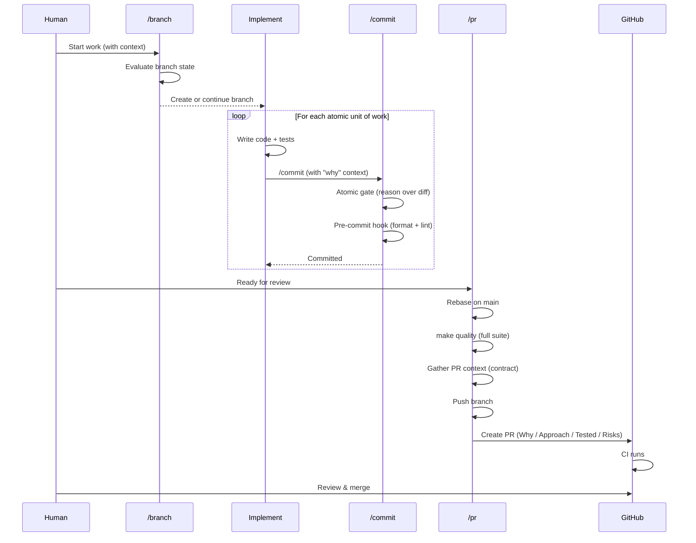

# Git Workflow — Design & Architecture

This document captures the *why* and *how* of the agent-driven git workflow used in this project. It's not a how-to guide — the skill files encode the operational details. This is for understanding the design, assumptions, and reasoning.

The workflow is designed to guide agent behavior so that git operations are handled with consistent quality — automatically. The human's role narrows to the parts only a human can provide: the reasoning behind changes, judgment on trade-offs, and approval before code reaches main. Everything mechanical — branch decisions, commit structure, quality checks, PR formatting — is handled by the agent following encoded rules.

> **Implementation note**: This workflow is built around [Claude Code](https://docs.anthropic.com/en/docs/claude-code) and its skills system (`.claude/skills/`). Throughout this document, Claude Code is referred to as *the agent*. The *principles* — trunk-based development, atomic commits, structured PRs, quality layering — are universal and adaptable to any AI-assisted development tool. The specific implementation (skills, `$ARGUMENTS` passing, `Skill()` invocations) uses Claude Code's features.

> **Makefile commands**: This project uses a [Makefile](../../Makefile) to bundle quality checks and development commands. Throughout this document, references like `make quality`, `make test-unit`, etc. are Makefile targets — run `make help` for the full list.

> **Status**: This workflow is being established as the standard going forward. Earlier commit history may not reflect it — that's the gap this workflow fills.

## The Problem

Agents can follow git best practices — but only if you encode them. Without an explicit workflow, each session starts from scratch and the agent improvises git operations with varying quality. The human ends up either micro-managing every commit message and branch decision, or accepting inconsistent output.

This workflow encodes the discipline once so it's applied automatically every time. The investment is paid upfront — defining the rules — and the returns compound with every operation: each well-structured commit feeds into a better PR description, each clean branch keeps the history navigable, each quality gate catches problems before they become expensive to fix.

### Why This Matters

A well-maintained git history enables debugging with `git bisect`, understanding decisions through `git blame`, safe reverts, and efficient code review. When git discipline is skipped, the cost compounds — each vague commit makes the next debugging session slower, each missing PR description makes the next review harder. This workflow inverts that dynamic: the benefits compound instead of the costs.

## Three Levels of Granularity

This is the core mental model. Every git operation in this workflow maps to one of three levels, each serving a distinct purpose with clear boundaries:

### Commit = Atomic Unit of Work

A commit represents one logical change that delivers standalone value:

- **Atomic**: Contains everything needed — code, tests, docs. Never half-finished.
- **Traceable**: The message explains *what* and *why*, not just *how*.
- **Revertable**: Can be cleanly undone without side effects.
- **Bisectable**: `git bisect` can pinpoint this commit because it doesn't bundle unrelated changes.

Small, focused commits reduce integration risk. Each one is a checkpoint — if something breaks, you know exactly where and can reason about what changed.

**Example** — a well-structured conventional commit message:

```
feat(knowledge): add LRU caching to KnowledgeLoader

Loading evaluation criteria from disk on every preflight call added
~200ms latency. LRU cache eliminates repeated reads within a session.

Chose LRU over TTL because data files are static within a session.
Cache invalidates on file change detection. Not invalidated for
mid-session edits — acceptable since data files only change between
releases.

Includes unit tests for empty cache, full cache, and invalidation.
```

The subject line tells you *what*. The body tells you *why this approach*, *what alternatives were considered*, and *what was tested*. This body becomes raw material for the PR description downstream — good commit messages compound into good PRs.

### Branch = Thematic Group ("Chapter")

A branch groups related commits into a coherent chapter of work. Examples:
- `feat/ai-steering-enhancements` — multiple commits improving different aspects of AI steering
- `fix/schema-validation-edge-cases` — several edge case fixes in the same system
- `docs/git-workflow-design` — documentation work on a single topic

**Why group, not one commit per PR?** Grouping related work reduces PR overhead and provides contextual coherence — the reviewer sees a complete story, not scattered changes.

**How many commits?** Typically a handful — enough to tell a coherent story, few enough to keep the branch short-lived. This isn't a fixed boundary; a branch might have one commit or several, depending on how much work belongs to the theme. The principle is: short-lived branches minimize merge conflicts and integration risk. If a branch grows large, that's a signal to split and PR sooner.

### PR = Human Review Gate

The PR is where human judgment enters. It's the boundary between "work was done" and "work is approved for main":

1. **Agent-generated code needs human oversight** — the agent may make technically correct but architecturally wrong choices.
2. **The description surfaces reasoning** — not just what changed (the diff shows that) but *why* and *what trade-offs were made*.
3. **It creates a permanent record** — the PR conversation becomes part of the project's decision history.

**The key constraint**: If a new task doesn't fit the current branch's theme, the current branch should be PR'd and merged first. This keeps main as the source of truth and prevents branches from forking off unreviewed work.

**Example** — a PR description that serves the reviewer:

```markdown
## Why

KnowledgeLoader reads evaluation criteria from disk on every preflight
call, adding ~200ms per invocation. For projects with frequent preflight
checks, this adds up noticeably.

## Approach

Added LRU caching keyed by file path. Chose LRU over TTL because data
files are static within a session — they only change between releases.
Cache invalidates when file modification time changes.

Considered a global module-level cache but rejected it because it would
persist across test runs and cause flaky tests. Instance-level cache on
KnowledgeLoader keeps the lifecycle clean.

## What Was Tested

- Unit tests: empty cache hit, populated cache hit, cache miss after
  file change, cache eviction at capacity
- Integration test: full preflight cycle with caching enabled
- Manual: verified ~200ms → ~2ms on second call in dev environment

## Risks

- Cache is not invalidated if data files are edited mid-session (by
  design — documented in docstring)
- LRU size is hardcoded at 128 entries — sufficient for current use but
  may need configuration if projects grow significantly
```

This format focuses on what GitHub doesn't already show. File lists, test pass counts, and implementation details visible in the diff are deliberately excluded — the reviewer can see those directly. What they can't see is *why this approach*, *what was rejected*, and *where to focus attention*.

## Why Trunk-Based Development

Based on trunk-based development principles ([trunkbaseddevelopment.com](https://trunkbaseddevelopment.com), Martin Fowler's branching patterns):

- **Main is always the deployable source of truth.** All changes arrive via PR. This is especially important when agents are generating code — the PR gate ensures a human reviews before anything reaches users of the library.
- **Feature branches are short-lived.** They group thematically related work and are deleted after merge. Short branches minimize divergence and merge conflicts.
- **Each commit is atomic and standalone.** Even on a multi-commit branch, any single commit delivers value.

**Why not GitFlow?** GitFlow adds ceremony (develop, release, hotfix branches) suited for projects with formal release trains. For a library with continuous delivery, trunk-based is simpler and faster.

**A note on overhead**: Requiring PRs for every change adds friction, especially for a solo developer. This workflow makes that trade-off deliberately — the library is used by others, and the PR gate ensures nothing reaches main without human review, particularly when the agent is doing the implementation. The goal is staying in control, not adding ceremony. The workflow is designed so that the mechanical parts — branch decisions, commit structure, quality checks, PR formatting — are handled by the agent. The human's only manual step is reviewing and merging the PR in GitHub, which is the whole point. The overhead lives in the automation, not on the developer.

## Quality Layering

Quality is enforced through six layers, each catching a different class of issues at increasing scope. This follows the **shift-left principle**: the earlier in the pipeline a problem is caught, the cheaper it is to fix. A missing "why" caught at the commit context check costs a quick question. A mixed-concern commit caught at the atomic gate costs seconds to split. The same problem discovered during PR review costs a conversation. Discovered after merge, it costs a revert and a new PR cycle. Each layer exists to catch problems at the cheapest possible point:

| Layer | What It Catches | When It Runs | How |
|-------|----------------|--------------|-----|
| **Commit context check** | Missing reasoning — vague or fabricated commit messages | Before each commit | Agent validates context contract: the "why" is available (via tiers 1–3) before writing |
| **Atomic commit gate** | Structural problems — mixed concerns, missing tests, incomplete work | Before each commit | Agent validates the staged diff is one concern, self-contained, with tests and docs |
| **Pre-commit hook** | Style problems — formatting, linting violations | On each `git commit` | `scripts/pre-commit` runs automatically via git hooks on staged files |
| **`make quality`** | Integration problems — test failures, cross-module issues | Before each PR | Full format + lint + test suite |
| **PR context check** | Missing reasoning — thin context that would produce fabricated PR descriptions | Before PR description is written | Agent validates context contract: Why / Approach / Tested / Risks are filled (via tiers 1–3) |
| **CI** | Environment problems — dependency issues, platform-specific failures | On PR creation/update | GitHub Actions in a clean environment |

Each layer has a distinct job. The commit context check ensures the agent has real reasoning before writing a commit message — no context, no commit. The atomic gate ensures the staged diff is structurally sound. The pre-commit hook enforces code style automatically — git runs `scripts/pre-commit` on every commit, and if it fails, the commit is blocked until the issues are fixed. When the hook fails, its output should be **diagnostic, not prescriptive** — it reports *what* failed and *where* so the agent can reason about the fix itself, rather than blindly following a hardcoded recovery command. `make quality` validates the branch as a whole before the agent pushes. The PR context check ensures the description has real reasoning, not fabricated filler. CI verifies in a clean environment that nothing was missed locally.

### Test Verification Points

Tests run at three points in the workflow, each with different scope and purpose:

1. **During `/close` (optional)**: Agent can run tests before commit if implementation changed
   - **When**: Before invoking `/commit` in the `/close` skill
   - **Scope**: Relevant tests for the changed module (fast subset)
   - **Command**: `pytest tests/unit/test_foo.py -v` or `pytest tests/unit/ -x --tb=line`
   - **Purpose**: Catch test failures early, before commit
   - **Trade-off**: Faster feedback loop vs. optional (agent decides based on change type)

2. **Pre-commit hooks (optional)**: Projects can enable test-running in hooks
   - **When**: On each `git commit` (if configured in `.git/hooks/pre-commit`)
   - **Scope**: Changed modules only (to keep it fast)
   - **Purpose**: Block commits with failing tests automatically
   - **Trade-off**: Guaranteed safety vs. slower commits
   - **Note**: Not enabled by default in this project due to performance impact

3. **During `/pr` (mandatory)**: `make quality` includes full test suite
   - **When**: Before pushing and creating PR
   - **Scope**: Full test suite (`pytest tests/`)
   - **Command**: `make quality` (format + lint + tests)
   - **Purpose**: Final gate before code leaves local machine
   - **Trade-off**: Comprehensive but slower (~37s)

**Recommended approach**: Run tests at `/close` time for implementation changes. This catches failures earlier than `/pr` without slowing down docs-only commits. The `/pr` quality gate ensures nothing is missed.

## How It All Fits Together



The human initiates work and reviews at the end. Everything in between — branch decisions, commit structure, quality gates, PR formatting — is handled by the agent following the encoded workflow. The human provides judgment; the agent provides the mechanical discipline.

## The Git Skills

Three skills handle all git operations. Each is independently usable — you can invoke `/commit` without `/branch`, or `/pr` at any point. They compose but don't require each other.

| Skill | Responsibility |
|-------|---------------|
| `/branch` | Evaluate branch state, create/continue/escalate |
| `/commit` | Stage changes, enforce atomic quality, write conventional commit |
| `/pr` | Sync with main, run quality suite, push, create PR |

Each skill follows the same two-phase structure: **gather context**, then **act**. The context gathering follows three tiers — mechanical, agent reasoning, human input — stopping as soon as the skill has what it needs. Each skill defines a **context contract**: the minimum information required to take its action confidently. The three tiers are how that contract gets fulfilled.

### `/branch` — Autonomous Branching

The `/branch` skill manages branching decisions through three steps: gather the branch landscape, gather the task theme, then decide and act.

#### Step 1: Gather Branch Landscape + Cleanup

`scripts/branch-context.sh` fetches from remote (to ensure `origin/main` is current), gathers the state of all local branches, and cleans up stale branches — all in one call without switching branches. A branch is stale when all its commits are already in main (`git branch --merged main`). Stale branches are deleted; branches with commits not in main are work in progress and kept. The agent reports what it removed.

After cleanup, the script outputs the remaining landscape: current branch state + any surviving WIP branches. This fulfills the first part of the context contract. A single script call replaces what would otherwise be multiple fragile tool calls.

#### Step 2: Gather Task Theme

**Context contract** — to make a branching decision, the agent needs: (1) the branch landscape (from step 1) and (2) the task theme. The task theme is where the tiers apply:

**Tier 1 — Mechanical**: `$ARGUMENTS` provides the task theme directly. Contract complete.

**Tier 2 — Agent reasoning**: No `$ARGUMENTS`. The agent tries to derive the task theme from what it already has, in this order:

1. **Branch landscape** — if WIP branches exist, their names, commit subjects, and changed files suggest the thematic area. If there's only one WIP branch, it's likely where work should continue.
2. **Conversation context** — what the human said earlier in this session may indicate what they want to work on.
3. **Task tracking** — `.agent/task-tracking.md` lists the current priority queue, which may indicate the next task's theme. (Only available when using the [Task Workflow](./task-workflow.md).)

If the agent can confidently determine the theme from these sources, the contract is complete.

**Tier 3 — Human input**: The agent has partial information but isn't confident. It presents what it knows — "I see [WIP branch X] with commits about [topic], and the next task in the queue is [Y]" — and asks specifically for what's missing.

#### Step 3: Decision and Action

Only once the contract is complete — branch landscape + task theme — does the agent decide:

- **Recommend `/pr` first**: When a WIP branch exists that doesn't fit the task. New branches should always start from the latest main — working on a second branch in parallel risks conflicts and divergence.
- **Rename**: When the current branch name is too narrow for the task theme (e.g., named after one specific task but the theme is broader). Only for unpushed branches — renaming a pushed branch is disruptive.

The full decision matrix is in the [escalation table](#autonomous-vs-escalation--design-intent) below.

### `/commit` — Conventional Commits with Reasoning

The `/commit` skill creates conventional commit messages (`<type>(<scope>): <description>`) with a body explaining *why*. It gathers context first, then uses that context for both atomicity validation and message writing.

**Context contract** — to write a meaningful commit, the agent needs:

1. **What changed** — the staged diff
2. **The full context** — why it changed, whether it's one concern, whether it's self-contained

The second part serves double duty: the same context that tells the agent *why* also tells it whether the diff is atomic. Once gathered, it feeds both the validation and the message.

#### Step 1: Stage

The agent stages all changes, *excluding* `.agent/` which must never be committed (it contains local task tracking and session state). `git diff --staged` provides the first piece of the contract: what changed, which files, which modules. Always mechanical.

#### Step 2: Gather Context

The agent gathers enough context to both validate atomicity and write the commit message. The tiers apply:

**Tier 1 — Mechanical**: `$ARGUMENTS` provides the reasoning, `git diff --staged` provides the technical details. Together they typically answer both "is this one concern?" and "why was this done?" Contract complete.

**Tier 2 — Agent reasoning**: No `$ARGUMENTS`. The agent derives context from what it has:

1. **Staged diff** — what files changed, what code was added/removed/modified.
2. **Git log** — recent commits provide context for what's been happening on this branch.
3. **Session conversation** — if the agent made the changes itself, it has the full reasoning in context.

Self-explanatory changes — clear bug fixes, renames, test additions — resolve here. The agent can typically determine both atomicity and the "why" from these sources.

**Tier 3 — Human input**: The agent can't confidently determine either atomicity or the "why." It presents what it *can* see and asks for the gaps — whether that's "are these one concern or should they be split?" or "what problem did this solve?" False information in a commit message is worse than a brief question.

#### Step 3: Validate Atomicity

With full context gathered, the agent validates the staged diff is atomic:

**Single concern** — Do all changes relate to one logical purpose? File paths clustering around one area is a good signal; unrelated modules appearing together is a red flag. A broad diff isn't a problem by itself (a rename across many files is fine) but is a signal to look closer at whether multiple concerns are mixed.

**Self-contained** — Does the commit include everything needed to be complete on its own?

- **Completeness**: Does this commit deliver standalone value, or is it half-finished work that only makes sense with a future commit?
- **Tests**: If behavior was added or changed, are tests included that cover that specific behavior — not just exist alongside it?
- **Documentation**: If the change introduces something significant — a new architectural pattern, a major design decision, a core abstraction — the agent evaluates whether documentation exists. If not, it escalates: surfaces what it identified as significant, proposes where and how to document it, and lets the human decide.

If the gate fails, the agent stops and reports what needs to be fixed. The gate is advisory — if the human explicitly overrides, it proceeds.

#### Step 4: Write the Commit

Once the contract is complete and atomicity is confirmed, the agent writes the conventional commit message: `<type>(<scope>): <description>` with a body explaining *why*. The pre-commit hook runs automatically — if it fails, the agent inspects the output, fixes the issues, re-stages, and retries.

#### Step 5: Confirm

After the commit succeeds, the agent runs `git status` to verify the commit was applied cleanly — no unexpected unstaged leftovers, no partial commits. This is a quick sanity check that catches silent failures.

### `/pr` — Human-Readable Pull Requests

The `/pr` skill creates the PR that serves as the [human review gate](#pr--human-review-gate). It follows six steps: verify the starting point, sync and validate, gather context, write the description, create the PR, and hand off to the human.

#### Step 1: Verify

The agent confirms it's on a feature branch (not `main`). If on main, it stops — but doesn't just say "nothing to PR." It runs `scripts/branch-context.sh` to gather the branch landscape. If feature branches exist, it presents them with their commit counts and topics, and asks which one the user wants to PR. If no feature branches exist, it reports that clearly. This turns a dead end into an actionable prompt.

#### Step 2: Sync + Validate

The agent rebases the feature branch on main (stopping for the human if conflicts occur) and runs `make quality` — the last local gate before code leaves the developer's machine. This ensures the branch is rebased and all checks pass before proceeding.

#### Step 3: Gather Context

**Context contract** — the agent needs four pieces: (1) why this work was done, (2) what approach was taken and why, (3) what was tested, and (4) what risks exist.

**Tier 1 — Mechanical**: The agent collects `$ARGUMENTS` and `git log main..HEAD` (commit subjects and bodies). When `$ARGUMENTS` are rich or commit bodies explain *why* — the typical case when `/commit` was used with good context upstream — the contract is fulfilled without needing to load the full diff.

**Tier 2 — Agent reasoning**: Tier 1 produces gaps — commit bodies have the *what* but not the *why*, or trade-offs aren't documented. The agent gathers `git diff main..HEAD` and reasons over the actual changes alongside the log. If it can fill the gaps confidently without fabricating, it does.

**Tier 3 — Human input**: The agent would have to fabricate reasoning. It presents what it *can* see ("This branch has N commits touching [modules]. The changes appear to [summary].") and asks for what's missing.

#### Step 4: Write the PR Description

Once the contract is complete, the agent uses the gathered context to write the structured description ([format above](#pr--human-review-gate)). The description focuses on what GitHub doesn't already show — not file lists or test counts, but reasoning, trade-offs, and where to focus attention.

#### Step 5: Create the PR + Hand Off

The agent pushes the branch, creates the PR with the description, and outputs the PR URL so the human can click through directly to review and merge.

#### Step 6: Switch to Main

The agent switches back to main and pulls to ensure it's current. This keeps main up to date for whatever comes next — whether that's `/branch` for new work or manual commands.

### How Context Contracts Compound

Each skill's context contract is partially fulfilled by the output of the previous skill. When `/branch` creates a well-named thematic branch, `/commit` has clearer scope signals — its contract is easier to fill from Tier 1. When `/commit` produces rich commit bodies, `/pr`'s contract (Why / Approach / Tested / Risks) is largely fulfilled by `git log` alone — Tier 1 again.

Conversely, thin upstream output cascades: vague commit messages leave `/pr`'s contract unfulfilled at Tier 1, forcing it into reasoning (Tier 2) or human input (Tier 3). The investment at each skill pays forward to the next one — this is the compounding effect in practice.

## Autonomous vs. Escalation — Design Intent

The workflow is designed around a principle: **the agent decides by itself when the answer is clear, and asks the human when genuinely uncertain.** Escalation is not failure — it's the agent being honest about its limits rather than fabricating.

| Situation | Intended Action |
|-----------|----------------|
| Stale branches (merged into main) | Clean up silently, report what was removed |
| On main, no WIP branches, has context | Create branch silently |
| On main, WIP branch fits task theme | Switch to it silently |
| On main, WIP branch doesn't fit task | Escalate: recommend finishing it first (`/pr`) |
| On main, multiple WIP branches | Escalate: present landscape, let human decide |
| On feature, task fits current branch | Continue silently |
| On feature, branch name too narrow (unpushed) | Rename silently |
| On feature, task clearly doesn't fit | Escalate: recommend `/pr` first |
| On feature, ambiguous fit | Escalate: present context, let human decide |
| Context provided for commit | Write conventional commit silently |
| No context, changes self-explanatory | Derive from diff, proceed |
| No context, changes ambiguous | Escalate: present what it sees, ask for the "why" |
| Changes span multiple concerns | Escalate: suggest splitting |
| Rebase conflicts | Escalate: help resolve |
| Quality check fails | Fix silently, retry |
| Commit bodies have reasoning | Assemble PR description silently |
| Commit bodies are thin | Derive what it can, ask for approach/trade-offs |

**How escalation works in practice**: The agent never asks a blank "what should the commit message be?" It presents what it *can* see (the diff, likely scope, its inference), and asks only for the gap. This makes escalation cheap for the human — confirm or correct, rather than explain from scratch.

**A note on reliability**: This table describes the *intended* behavior — the design target. The quality of these decisions depends on how well the agent interprets the skill instructions in practice. The workflow encodes the target; consistent results require testing and refinement over time.

## How the Pieces Compose

### Standalone Usage

Each git skill works independently. The text after the command becomes `$ARGUMENTS` — the context the skill uses:

```
# Just commit current changes:
/commit "Refactored the parser to handle nested YAML blocks"

# Just create/evaluate a branch:
/branch "Working on schema validation improvements"

# Just create a PR from the current branch:
/pr "This branch adds the knowledge module with caching and graceful degradation"
```

### Multi-Session Flow

A typical multi-session project flow:

```
Session 1:
  /branch "schema validation"  →  implement  →  /commit "why + what"

Session 2:
  /branch "still schema work"  →  continues  →  /commit "why + what"

Session 3:
  /pr  →  rebase, quality check, push, create PR
  (human merges in GitHub)
  /branch "new topic"  →  implement  →  /commit
```

## Troubleshooting: Tests Failing at `/pr` Time

If tests fail when you run `/pr`, but you don't remember breaking them, follow this recovery process:

### 1. Identify Which Commit Broke Tests

```bash
# View recent commits on this branch
git log main..HEAD --oneline

# Check out each commit and run tests
git checkout <commit-sha>
pytest tests/unit/  # or the specific test that's failing
```

Repeat for each commit until you find the one that introduced the failure.

### 2. Fix the Tests

Return to your branch head:
```bash
git checkout <your-branch-name>
```

Fix the failing tests based on what you found.

### 3. Decide How to Commit the Fix

**Option A: Add fix as new commit (recommended)**
- Safer, preserves full history
- Shows that the issue was caught and fixed
- Command: Standard commit via `/close` or `/commit`

**Option B: Amend the breaking commit (advanced)**
- Cleaner history, but requires rewriting commits
- Only use if the branch hasn't been pushed yet
- Commands:
  ```bash
  git rebase -i main
  # Mark the breaking commit for 'edit'
  # Make your fix
  git add .
  git commit --amend
  git rebase --continue
  ```

**Recommendation**: Use Option A (new commit). It's safer and preserves the full development history. The PR reviewer can see that tests failed and were fixed.

### 4. Re-run `/pr`

Once tests are fixed:
```bash
# Verify tests pass locally
pytest tests/unit/ -x --tb=line

# Or run full quality suite
make quality
```

Then invoke `/pr` again. It will:
- Rebase on main (if needed)
- Run `make quality` (should pass now)
- Create/update the PR

### Prevention: Run Tests During `/close`

To catch test failures earlier (before `/pr` time):

**For implementation changes**:
- Run relevant tests before calling `/close`
- The `/close` skill documentation includes guidance on when to run tests
- Example: `pytest tests/unit/test_foo.py -v` before committing

**For docs-only or test-only changes**:
- Skip test-running at `/close` time
- Tests will still run at `/pr` time (mandatory)

See [`.claude/skills/close/SKILL.md`](../../.claude/skills/close/SKILL.md) Step 3 for the full test verification guidance.

### Integration with Other Systems

The git skills are designed to be standalone. When used with a task workflow (like the [Task Workflow](./task-workflow.md)), richer context flows in — session summaries, task specifications, structured reasoning — which produces better commit bodies and PR descriptions. But the git skills don't *require* this. They work with whatever context is available, whether it comes from a task system, from the human directly, or from the agent's own analysis of the diff.
